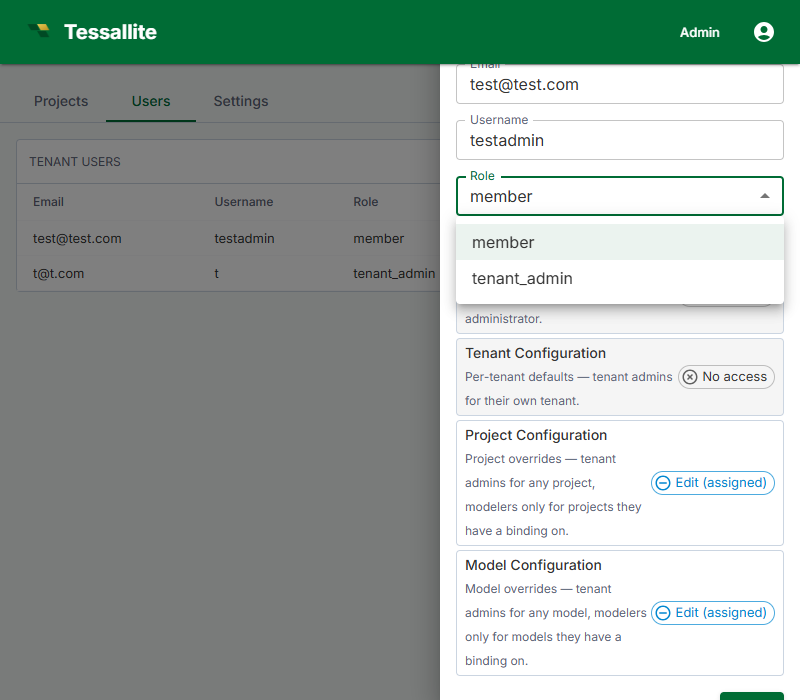

## What this covers

This article explains the Tessallite roles, how to change a user's workspace role, the difference between workspace-level and project-level access, and how to assign project-level permissions. There are four standard roles (below) plus one special **audience** role, `model_technical`, described after the capabilities table.

---

## Role overview

| Role | Scope | Who assigns it | What they can do |
|------|-------|---------------|-----------------|
| System Admin | Installation-wide | Defined by environment variables at deployment; not assignable via UI. | Create workspaces, manage all workspace users, access the System Administration screen. |
| Tenant Admin | Workspace-wide | System Admin (initial); Tenant Admin (additional) | Invite and remove users, assign roles, configure workspace settings. |
| Modeller | Workspace-wide (with per-project access) | Tenant Admin | Create and edit models, define dimensions and measures, configure aggregates and schedules, view diagnostics. |
| Analyst / Viewer | Per project | Tenant Admin or Modeller (via project settings) | Connect BI tools via JDBC or XMLA, run queries, view query results. |
| `model_technical` (audience) | Per user | Tenant Admin (User management) or via SSO Group Mappings | A special *audience* role, not a permission tier. It pins the user to the **technical persona** so column-level security and data-tag rules show them the technical (unmasked-where-permitted) view. It grants **no** project permissions on its own. |

---

## The `model_technical` audience role

`model_technical` is different from the four roles above. The four standard roles control **what a user can do**; `model_technical` controls **which persona's view a user sees** when column-level security and data tags are in play. Assigning it does not let someone edit models or run privileged actions — it only selects the technical persona for that user.

Use it for engineers and data stewards who need to see technical column detail that business personas hide. You set it two ways:

- **Per user** — in Tenant Admin → Users, set the user's role to `model_technical`.
- **By SSO group** — map an identity-provider group to `model_technical` in Group Mappings, so members of that group inherit the technical persona automatically.

Because it confers no project access by itself, a `model_technical` user still needs the usual project-level Viewer/Modeller binding to reach a project at all. See [Configure personas](../modelling/configure-personas.md) for how the technical persona is defined and [Group mappings](group-mappings.md) for the SSO route.

---

## Role capabilities reference

| Action | System Admin | Tenant Admin | Modeller | Analyst |
|--------|-------------|-------------|---------|---------|
| Create workspaces | Yes | No | No | No |
| Manage workspace users | No | Yes | No | No |
| Configure workspace settings | No | Yes | No | No |
| Create / edit models | No | No | Yes | No |
| Configure aggregates | No | No | Yes | No |
| Connect BI tools | No | No | Yes | Yes |
| Run queries | No | No | Yes | Yes |

---

## Changing a user's workspace role

1. In the workspace sidebar, click **Admin**.
2. Click the **Users** tab.
3. Click the user's name to open their detail panel.
4. In the **Role** dropdown, select the new role.
5. Click **Save**.

The change takes effect on the user's next sign-in. Existing sessions continue with the old role until the user signs out and signs back in.

---

## Workspace-level vs. project-level access

Tenant Admin and Modeller are workspace-wide roles. An Analyst role at the workspace level provides no project access by default — users must be explicitly added to each project.

---

## Assigning project-level access

1. Open the project in Model Builder.
2. Click **Settings** in the project toolbar.
3. Click the **Access** tab.
4. Click **Add User**, enter the user's email, and select their project-level permission: **Viewer** or **Modeller**.
5. Click **Save**.

A user's workspace role is the ceiling for their effective permissions. A Modeller cannot be granted Tenant Admin access at the project level. Change the workspace role first if a higher level is needed.

**Project roles and model versions.** The project-level role also decides what a user may do with a model's version history, because reverting is a high-impact change to the live model:

- A **Viewer** can open the version history and compare past versions.
- A **Modeller** can additionally save a new version and deploy or undeploy.
- **Reverting** to an earlier version (which rewrites the live model and moves the deployed pointer — it appends a new version and never deletes any history) requires the project **Admin** role.

See [Save and version a model](../modelling/save-and-version-a-model.md) for the full version workflow.

---

## Open project access before the first binding (the bootstrap rule)

When a project has **no project-level access entries at all**, Tessallite treats every signed-in user of the workspace as that project's administrator. This is called the *bootstrap rule*, and it exists so the person who creates a project can set it up — add connections, build a model, grant access — without being locked out of their own brand-new project.

Think of it like a new office room before the locks are fitted: anyone with a badge for the building can walk in and arrange the furniture. The moment the first lock is fitted (the first access entry is saved), only people named on the door get in.

**What this means in practice:**

- A freshly created project is open to *everyone in the workspace* — including users who normally only view things — until someone saves the first access entry.
- The very first access entry you add closes the door: from then on, only listed users (and workspace admins) can touch the project.

**This behaviour is deliberate.** It was reviewed and kept as an accepted trade-off: convenience for small teams over strictness for large ones. Two safeguards apply:

1. **Audit trail.** Every time a user without any access entry is let in by the bootstrap rule, an audit event named `rbac.bootstrap_admin_grant` is written (severity *warn*). It records who used the open door and on which project. To avoid flooding the log, repeat visits by the same user to the same project are recorded at most once per hour per service instance. Review these events in *Admin > Audit Log*.
2. **You can close the door early.** Right after creating a project, add yourself (or your team) on the **Access** tab. One entry is enough to end the open period.

**Best practice for multi-team workspaces:** make "add the first access entry" part of your project-creation checklist. Until that entry exists, treat the project as visible to the whole workspace and keep sensitive connection credentials out of it.

---

## Related

- [Manage Users](manage-users.md)
- [Workspace Settings](workspace-settings.md)
- [Roles and Permissions (concepts)](../concepts/roles-and-permissions.md)

---

← [Manage Users](manage-users.md) | [Home](../index.md) | [Model-Scoped RBAC →](rbac-model-scoped.md)
