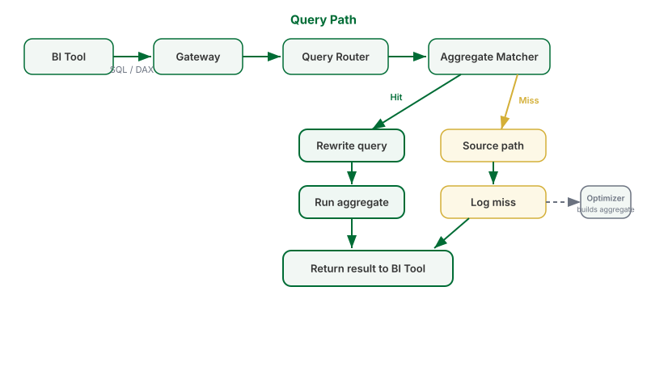

## What this covers

The quiet promise underneath every walkthrough in this section: the figure in your Excel dashboard equals the figure in your colleague's Power BI report equals the figure in a notebook — and what makes that true. Understanding these five ideas once will make you a faster, more confident consumer of every Tessallite model you ever connect to.

---

## Idea 1 — There is exactly one definition of every number

When you drag `net_sales` in Excel, Tableau, Power BI, or a Python query, you are not summing a column. You are asking for a **measure**: a definition written once by the model owner — which column, which aggregation, which currency handling, which time behaviour — stored in the semantic model.

Every tool asks the model. The model computes. The tool draws.

That is the whole trick, and it is worth contrasting with the old way. Before a semantic layer, "net sales" lived in a dozen places at once: a formula in someone's Excel, a DAX measure in someone's Power BI, a SQL snippet in someone's notebook. Each was a private interpretation. They drifted, quietly, until the quarterly review opened with twenty minutes of "why doesn't your number match mine?" With the model in the middle, that meeting starts with the numbers already agreeing, because there was never more than one definition to disagree about.

---

## Idea 2 — Grain: the question "per what?" always has an answer

Every number has a **grain** — the level of detail it is measured at. Sales *per product per day* is a different question from sales *per country per month*, and a good model makes the grain explicit rather than assumed.

Why you care as a consumer:

- When you drag `product_name` next to `net_sales`, you have *set* the grain to "per product". The number beside each product answers that exact question.
- When a number looks surprisingly big or small, the first thing to check is the grain — did you accidentally ask for a grand total (no dimensions) when you meant per-region?
- When you compare two reports, match the grain first. A per-month figure and a per-quarter figure from the same model will differ by roughly three, and both are right.

> **A quick self-test.** Before trusting any figure, finish the sentence out loud: "This is net sales, per …". If you cannot finish it from what is on screen, add or remove a dimension until you can.

---

## Idea 3 — Fast answers and fresh answers are the same answers

Tessallite keeps pre-computed summaries (aggregates and pockets) of the model, and quietly answers your questions from them when they cover what you asked. When none fits, the question goes to the governed source path.

The part that matters to you: **both paths return the same numbers.** A summary is not a stale copy someone exported last month — it is maintained by the platform as the data changes, defined from the same model, and chosen automatically. There is no "fast but wrong" button and no "fresh but slow" button. Your Monday dashboard can be both instant and current, and you never have to know which path served it. (If you are curious, [Live vs Aggregate](../querying/live-vs-aggregate.md) shows how to tell — but you never need to in order to trust the figure.)

---

## Idea 4 — Security is applied before the data reaches you

Your sign-in carries your **persona** and your **row security** rules. Every query — Excel, Power BI, Tableau, notebook, agent — is filtered by them before a single row leaves Tessallite.

Two consequences, both healthy once you expect them:

- **You may legitimately see different rows than a colleague.** If you are scoped to Europe and your dashboard's grand total is the European total, that is the security working, not a discrepancy. Comparing numbers? Compare scopes first.
- **You cannot accidentally leak what you cannot see.** A drill-through, a copied query, a shared notebook — all of them re-apply your rules on every execution. There is no back door through a cleverer tool.

If a field you need is missing from your field list, that is your persona's scope. The fix is a conversation with your administrator, not a workaround.

---

## Idea 5 — If everyone uses the model, everyone can trust each other

The system only holds while the numbers people quote come from the model. The failure mode to watch for is always the same shape: a private copy. A pasted figure in a board deck. An extract in a workbook. A hand-summed column in a notebook. Each one is a number that will not update, cannot be checked, and will eventually disagree with the official one — in a meeting, in public.

The habits that keep you on the right side are all small:

1. **Refresh, never re-paste.** Every walkthrough in this section ends in a refreshable artifact. Use that button.
2. **Quote the governed name.** "Net sales per product, from `modelx`, refreshed this morning" is a claim people can verify. "Sales, roughly" is not.
3. **Send new metrics to the model.** The moment a calculation matters to more than one person, it deserves to be a governed measure — defined once, then identical in every tool forever.

---

## The five ideas in one picture

Your question travels the same path no matter which tool asked it: through the gateway, mapped to the model's definitions, answered from a summary when one covers it, filtered by your security, and returned as the same rows everyone else would get for the same question and the same scope.

One definition. One grain per question. One security check. Every tool, every time. That is why your numbers match.

---

## Where to go next

- New to the platform? [What is Tessallite](../getting-started/what-is-tessallite.md) and [How Tessallite Works](../getting-started/how-tessallite-works.md) tell the same story from the platform side.
- Want the modelling view of these ideas? [Dimensions and Measures](../concepts/dimensions-and-measures.md) and [Query Routing](../concepts/query-routing.md).
- Ready to build? Pick your tool in [Choose Your Connection](choosing-your-connection.md).

---

## Related

- [How Tessallite Works](../getting-started/how-tessallite-works.md)
- [Live vs Aggregate](../querying/live-vs-aggregate.md)
- [Roles and Permissions](../concepts/roles-and-permissions.md)
- [Dimensions and Measures](../concepts/dimensions-and-measures.md)

---

← [Query Tessallite from a Jupyter Notebook](query-tessallite-from-jupyter.md) | [Home](../index.md) | [Workspaces and Tenants →](../concepts/workspaces-and-tenants.md)
