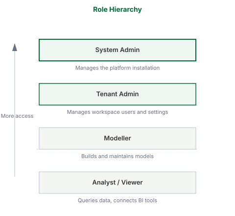

## What this covers

This article describes the four roles in Tessallite, what each role can do, and how roles are assigned and take effect.

---

## The four roles

### System Admin

The System Admin manages the Tessallite installation itself. There is one system admin per installation. This role is defined by environment variables set during deployment — it is not stored in the application database and cannot be created or removed through the interface.

The System Admin can:

- Create and list workspaces
- Create users within any workspace
- Access the System Administration screen

The System Admin cannot access workspace-level content, including projects, models, and data.

---

### Tenant Admin

The Tenant Admin manages users and settings within a single workspace. Multiple users in the same workspace can hold the Tenant Admin role.

The Tenant Admin can:

- Invite and remove users
- Assign roles to users within the workspace
- Configure workspace settings

---

### Modeller

The Modeller builds and maintains data models. This role is assigned per project within a workspace.

The Modeller owns the full model lifecycle within a project. The Modeller can:

- Create, rename, import, export, deploy, and delete models
- Define tables, joins, dimensions, and measures
- Configure aggregates and refresh schedules
- Configure the project's conversational agent
- Rename a project
- View diagnostics and model health
- Run queries and view results

The Modeller cannot perform project- or tenant-level structural actions:

- Create, delete, or enable/disable a project
- Manage source connections, LLM providers, or branding
- Manage user access control, audit, webhooks, or SSO mappings

These are Tenant Admin actions. In the project setup drawer a Modeller sees only the agent-configuration tabs; the administration sections are hidden.

---

### Analyst / Viewer

The Analyst connects BI tools and queries data. This role is assigned per project.

The Analyst can:

- Connect via JDBC or XMLA
- Run queries
- View data returned by the model

The Analyst cannot:

- Edit models, dimensions, measures, or joins
- Add or remove data sources
- Manage users

---

## How roles are assigned

The Tenant Admin assigns workspace-level roles (Tenant Admin) from the Admin panel. Project-level roles (Modeller, Viewer) are assigned from the project's Access settings.

Role changes take effect immediately. There is no caching or delay.

---

## Role hierarchy

Roles are ordered from lowest to highest access:

Analyst → Modeller → Tenant Admin → System Admin

A user with a higher role holds all capabilities of the roles below it in the hierarchy.

---

## Permissions reference

| Action | System Admin | Tenant Admin | Modeller | Analyst |
|---|---|---|---|---|
| Create workspaces | Yes | No | No | No |
| Manage workspace users | No | Yes | No | No |
| Create / delete project | No | Yes | No | No |
| Enable / disable project | No | Yes | No | No |
| Rename project | No | Yes | Yes | No |
| Manage source connections / branding | No | Yes | No | No |
| Manage user access control | No | Yes | No | No |
| Create / rename / deploy / delete models | No | Yes | Yes | No |
| Configure aggregates | No | Yes | Yes | No |
| Configure conversational agent | No | Yes | Yes | No |
| Connect BI tools | No | Yes | Yes | Yes |
| Run queries | No | Yes | Yes | Yes |

A higher role can do everything the roles to its right can do. The model-service enforces every action server-side; the interface additionally hides controls a role cannot use.

---

## Explorer operation matrix

This is the complete list of what each role can do in the Explorer — the screen where you browse projects, open models, and reach the project setup drawer. **Viewer** is the read-only role (also called Analyst). **Yes** means the control appears and works for that role; **No** means it is hidden, and the server would refuse the action even if it were reached another way.

Each role includes everything the role to its left can do: a Modeller can do everything a Viewer can, and a Tenant Admin can do everything a Modeller and Viewer can.

### Browse and query

| Operation | Viewer | Modeller | Tenant Admin |
|---|---|---|---|
| Browse projects and models | Yes | Yes | Yes |
| Run queries and view results | Yes | Yes | Yes |

### Workspace and project actions

| Operation | Viewer | Modeller | Tenant Admin |
|---|---|---|---|
| Create a project | No | No | Yes |
| Delete a project | No | No | Yes |
| Enable or disable a project | No | No | Yes |
| Import or export a project | No | No | Yes |
| Rename a project | No | Yes | Yes |

### Project setup drawer

| Section | Viewer | Modeller | Tenant Admin |
|---|---|---|---|
| Open the drawer | No | Yes | Yes |
| Agent configuration tabs | No | Yes | Yes |
| Source connections | No | No | Yes |
| LLM providers | No | No | Yes |
| Branding | No | No | Yes |
| User access control | No | No | Yes |
| Audit log, webhooks, SSO mappings, security audit | No | No | Yes |

A Modeller who opens the drawer sees only the agent-configuration tabs. The administration sections do not appear.

### Model actions

| Operation | Viewer | Modeller | Tenant Admin |
|---|---|---|---|
| Add a model | No | Yes | Yes |
| Rename a model | No | Yes | Yes |
| Import or export a model | No | Yes | Yes |
| Deploy or undeploy a model | No | Yes | Yes |
| Delete a model | No | Yes | Yes |

A Modeller owns the full model lifecycle — including deleting a model — because that is part of building and maintaining a model. Project-level structure (creating, deleting, or disabling a project) stays with the Tenant Admin.

---

## Related

- [Manage users](../admin/manage-users.md)
- [Manage roles](../admin/manage-roles.md)
- [Workspaces and tenants](workspaces-and-tenants.md)

---

← [Model Health](model-health.md) | [Home](../index.md) | [Calendar Types →](calendar-types.md)
