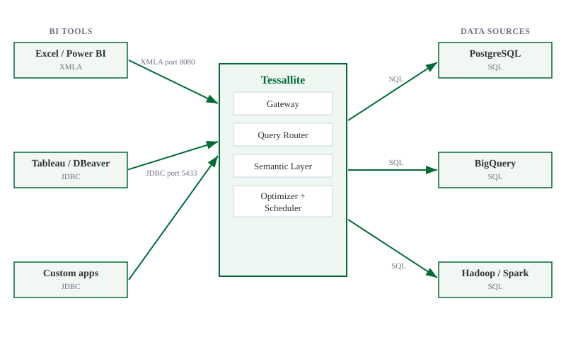

## What this covers

This article explains Tessallite in plain language: what it does, why a team would put it between BI tools and data, and what changes for analysts, modellers, and platform owners.

---

## What Tessallite does

Tessallite sits between BI tools and governed data sources.

When a BI tool sends a SQL, DAX, or MDX query, Tessallite checks the request against the semantic model: the approved definitions of measures, dimensions, joins, calendars, personas, and security rules. If a pre-aggregated summary can answer the question, Tessallite routes the query to that faster table. If not, it runs the query against the source through the same governed gateway.

The analyst does not need a new reporting tool or a new query language. The important contract is that the answer means the same thing whichever route Tessallite chooses.

---

## What problem it solves

Most reporting teams carry two kinds of waste. The first is compute waste: the same totals, counts, and period comparisons are recalculated from detailed rows again and again. The second is trust waste: different tools grow different definitions of the same metric, so people spend time reconciling reports instead of using them.

Tessallite attacks both problems together. The semantic model gives the business one place to define "Revenue", "Active Customer", "Fiscal Month", or "PII". The optimizer watches repeated query patterns and builds summaries where they will save time and cost. A compatible future query can then use the smaller summary instead of scanning the detailed source rows.

The result is not magic caching. It is governed acceleration: faster answers that still obey the model, security rules, personas, and source permissions.

---

## What the analyst sees

To the analyst, Tessallite appears as a familiar database or XMLA endpoint.

They connect from Excel, Power BI, Tableau, DBeaver, or another supported client. They browse friendly measures and dimensions, build a pivot or query, and receive rows back.

In most tools the result looks ordinary, because it should. Modellers and admins can inspect route badges, query logs, and usage analytics to see whether a query used an aggregate, a pocket table, or the source path.

If a report is unexpectedly slow, that is a modelling signal rather than a mystery. It may need a better grain, a missing aggregate, a source statistic refresh, or a security rule that requires the source path.

---

## Supported BI tools

Tessallite exposes two connection endpoints.

**JDBC endpoint — port 5433**

Any PostgreSQL-compatible client can connect to port 5433. Supported tools include:

- Tableau
- DBeaver
- Power BI (via PostgreSQL connector)
- Excel (via PostgreSQL ODBC or JDBC bridge)
- Custom applications using psycopg2 or any PostgreSQL driver

**XMLA/DAX endpoint — port 8080**

Excel and Power BI can connect to port 8080 using the XMLA protocol. This endpoint accepts DAX queries in addition to SQL.

---

## Supported data sources

Tessallite can connect to the following data sources:

- **PostgreSQL** — any version supported by the JDBC PostgreSQL driver
- **BigQuery** — via the BigQuery JDBC driver
- **Hadoop / Spark Thrift Server** — via the Hive JDBC driver

A single Tessallite installation can connect to multiple data sources. Each project within a workspace connects to one data source.

---

## The semantic model

A modeller defines a semantic model for each project. The model describes dimensions, measures, and joins in terms of the underlying tables.

Every BI tool that connects to that project sees the same model. There is no per-tool configuration. A dimension defined once appears in Tableau, Power BI, and DBeaver without additional setup.

The model also controls how Tessallite builds summaries. Tessallite uses the model's aggregation rules to determine which pre-aggregated tables to create and maintain.

---

## Related

- [How Tessallite works](how-tessallite-works.md)
- [Workspaces and tenants](../concepts/workspaces-and-tenants.md)
- [Connect a BI tool](connect-a-bi-tool.md)

---

← [Tessallite Help](../index.md) | [Home](../index.md) | [How Tessallite Works →](how-tessallite-works.md)
