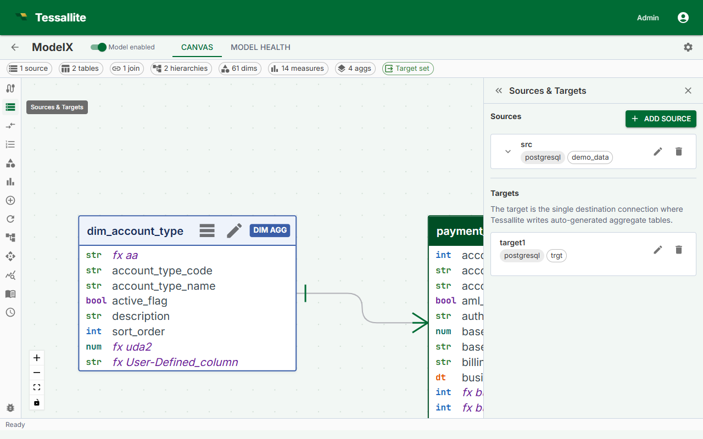

## What this covers

Before you can define dimensions, measures, or aggregates, you must add the source tables you intend to use into the model. This article explains how to navigate to the Model Builder, browse the schema, add tables, and choose the correct table type for each one.

---

## Before you start

- A project must exist and its data source connection must be working. See [Create a Project](create-a-project.md) and [Add a Data Source](add-a-data-source.md).
- You must be signed in as a Modeller or Tenant Admin on the project.

---

## Steps

1. Open the project from the workspace dashboard.
2. Click **Model Builder** in the project navigation. The Model Builder opens with the Canvas (center), Toolbelt (left), Drawer (right), and Summary Bar (bottom).
3. In the Toolbelt, click **Add Table**. The Drawer opens showing the schema browser.
4. Expand a schema in the browser to see its tables.
5. Click a table name to select it. The Drawer shows the table's columns and a **Table type** selector.
6. Choose the correct table type (see the reference below).
7. Click **Add to Model**. The table appears as a node in the Canvas.
8. Repeat for each table you need.

---

## Table type reference

Choosing the right type determines how Tessallite constructs the aggregate grain — the combination of columns used when building pre-aggregated summary tables.

| Table type | When to use | Example | Included in aggregate grain? |
|---|---|---|---|
| `fact` | The central transaction or event table. Every model must have exactly one. Contains numeric measures and foreign keys to dimension tables. | `orders`, `page_views`, `sensor_readings` | Yes |
| `dim_aggregate` | A dimension table that participates in the aggregate grain. Use when you want pre-aggregation to group by columns in this table. | `dim_date`, `dim_product` | Yes |
| `dim_detail` | A dimension table used only for filtering or labeling. Its columns are not included in aggregate grain. | `dim_customer`, `dim_employee` | No |

> A model must have exactly one `fact` table. If you mark a second table as `fact`, the Health tab shows a validation error and the model cannot be published.

---

## What the Canvas shows

Each table appears as a card showing the table name and type badge. Tables with no join are shown with a dashed border and flagged as a warning in the Health tab until all tables are joined.

Click a table-node header to focus the matching row in the **Sources** panel — the source expands and the row is briefly highlighted. From there, the **Edit** pencil opens the unified table editor (General · Columns · Attributes) where you can change the type, rename the alias, edit columns, and manage user-defined attributes. See [Dimension Aliases](dimension-aliases.md) for the full editor walkthrough.

If the source catalogue is larger than the listing limit, the Sources panel shows a banner that the list is incomplete. That banner is not a table. Filter by schema. BigQuery classify uses approximate distinct counts, not a full `COUNT(*)` scan.

Tessallite carries the "list is incomplete" signal in a reserved schema named `__tessallite__`. That schema and any table in it are never real source objects and are never shown as addable tables — they are stripped from the browser and only raise the incomplete-list banner. A genuine table of your own named `__truncated__` in an ordinary schema (for example `public`) stays fully selectable.

---

## Removing a table

Select the table in the Canvas, then click **Remove from Model** in the Drawer. All joins, dimensions, and measures referencing that table are also removed. This action cannot be undone.

---

## Related

- [Sources, Tables, and Joins](../concepts/sources-tables-and-joins.md)
- [Define Joins](define-joins.md)
- [Create a Project](create-a-project.md)

---

← [Add a Data Source](add-a-data-source.md) | [Home](../index.md) | [Source Statistics →](source-statistics.md)
