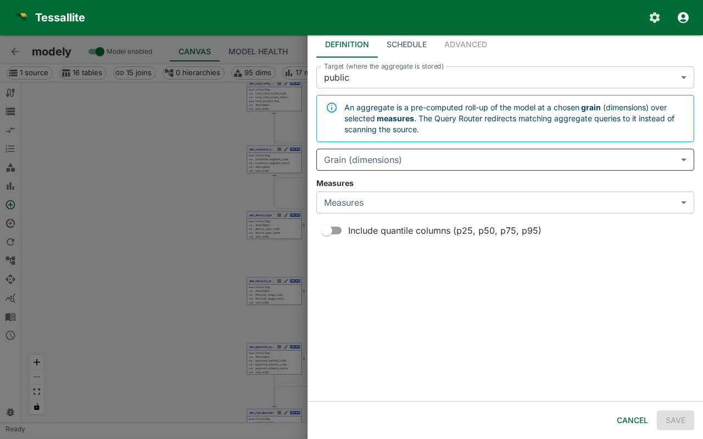

## What this covers

An aggregate is a pre-computed summary table stored in the query target. When a BI query matches an available aggregate, Tessallite reads from the summary instead of scanning the full fact table. This article covers the two ways aggregates are created, the manual configuration workflow, aggregate properties, and how the grain controls which queries an aggregate can serve.

---

## Two ways aggregates are created

- **Manual configuration** — You define the aggregate explicitly: you choose the name, grain, measures, and refresh schedule. Manual aggregates persist until you delete them.
- **AI Optimizer auto-creation** — The Optimizer analyses query patterns observed by the Gateway and creates aggregates automatically at grains it calculates will reduce the most query cost. Auto-created aggregates can be retired by the Optimizer if query patterns change. They are visible in the Canvas alongside manual aggregates.

Both types coexist in the same model. Manual aggregates give you explicit control over high-priority query patterns; auto-created aggregates fill in the gaps based on actual usage.

---

## Aggregate properties

| Property | Description |
|---|---|
| Name | Internal identifier for the aggregate. Used as the summary table name in the query target schema. |
| Grain (dimensions) | The set of dimensions that define the level of detail in the summary. Every distinct combination of dimension values becomes one row in the summary table. |
| Measures | The measures to include in the summary. Only measures defined in the model can be selected. |
| Refresh schedule | A cron expression or preset that controls when the Scheduler re-queries the source and overwrites the summary. |

---

## How the grain controls query matching

The Query Router matches an incoming query to an aggregate when the query's requested dimensions are a subset of the aggregate's grain and the requested measures are all present in the aggregate. A query asking for revenue by country and month matches an aggregate whose grain includes country and month — even if the aggregate also includes a region dimension that the query does not use. The router selects the aggregate with the smallest grain that still covers the query.

For additive measures (SUM, COUNT, AVG, MAX, MIN), the router can re-aggregate from coarser summaries. For COUNT DISTINCT, the grain must match exactly.

---

## Cron schedule presets

| Preset | Cron expression | When it runs |
|---|---|---|
| Every hour | `0 * * * *` | At the start of every hour |
| Every 6 hours | `0 */6 * * *` | At 00:00, 06:00, 12:00, 18:00 UTC |
| Daily at 02:00 | `0 2 * * *` | Once per day at 02:00 UTC |
| Weekly (Sunday 03:00) | `0 3 * * 0` | Every Sunday at 03:00 UTC |

You can enter any valid cron expression in the schedule field if none of the presets match your requirements. All times are interpreted as UTC.

---

## The Aggregate Drawer

Manual aggregate work — both creation and editing — happens in the **Aggregate Drawer**: a right-anchored 720 px panel with three tabs.

| Tab | Purpose |
|---|---|
| Definition | Target, grain (dimensions), measures, include-quantiles toggle, status. |
| Schedule | Cron picker plus the **Schedule enabled** switch and the recent run history. |
| Advanced | Read-only metadata — physical table name, status, created timestamp, retired timestamp, estimated hit rate, creation reason, AI rationale, invalid reason. |

In edit mode the drawer header carries a **Refresh now** button that triggers an immediate full rebuild (the Scheduler endpoint runs the same job a cron tick would have run). Closing the drawer with unsaved changes prompts for confirmation.

---

## Authoring workflow (create)

1. Open the model in Model Builder. Confirm that a query target is set under **Settings** before proceeding — aggregates cannot be built without a target.
2. Click **Aggregates** in the Toolbelt.
3. Click **New**. The Aggregate Drawer opens on the **Definition** tab.
4. Pick a **Target** (where the summary table is stored).
5. Select the **Grain (dimensions)**. Every distinct combination of dimension values becomes one row in the summary table. Dimensions whose value is functionally equivalent to another dimension's value (a redundant partner) are disabled with a tooltip explaining why.
6. Select the **Measures** to include. The default aggregation function (`SUM`, `AVG`, etc.) shown next to each measure name is what will be computed at create time. Non-additive measures are flagged with a chip.
7. Optionally enable the advanced statistical columns:
   - **Include quantile columns (p1, p5, p10, p25, p50, p75, p90, p95, p99)** — lets the router serve `MEDIAN` and `PERCENTILE_CONT`/`PERCENTILE_DISC` queries from the aggregate.
   - **Include dispersion-stat columns (STDDEV_POP, STDDEV_SAMP, VAR_POP, VAR_SAMP)** — lets the router serve standard-deviation and variance queries from the aggregate.
   Both are opt-in because they add extra columns per numeric measure, and both can only be served at the aggregate's exact grain (see *How aggregates store data*).
8. The **Aggregate estimate** card appears live as you change selections, showing the ROI score and any non-additive warnings.
9. Switch to the **Schedule** tab. Turn the **Schedule enabled** switch on, pick a cron expression with the picker, then click **Save**.
10. The aggregate is queued for an initial build by the Scheduler. The card shows status **creating** and transitions to **active** once the first refresh completes.

> The first build runs as soon as the Scheduler picks up the job, typically within one minute. If the status stays in **creating** for more than five minutes, check the Diagnostics panel for Scheduler errors.

---

## Edit mode

Editing scope is intentionally narrow:

- **Editable** — schedule (cron + enabled), status (active / retired), include-quantiles and include-stats toggles, refresh-now trigger.
- **Read-only** — target, grain, measures. The drawer renders these as static chips with the note "*To change the shape, delete this aggregate and create a new one.*" Aggregate shape changes go through delete-and-recreate so the physical table identity matches the definition.

The **Definition** tab shows the AI rationale card when the aggregate was created by the AI optimiser. The **Advanced** tab exposes the rest of the metadata.

The footer carries a **Delete** button (left) that asks for confirmation before retiring the aggregate and dropping its physical table.

---

## How aggregates store data

Each measure included in an aggregate generates multiple physical columns in the summary table. This allows the Query Router to serve a wider range of SQL functions from the same aggregate without re-scanning the source.

| Measure type | Physical columns created |
|---|---|
| SUM measure | `sum`, `count`, `min`, `max` |
| AVG measure | `avg`, `sum`, `count`, `min`, `max` |
| COUNT measure | `count`, `min`, `max` |
| MIN measure | `min`, `count`, `max` |
| MAX measure | `max`, `count`, `min` |
| Any numeric measure, **Include quantiles** on | adds `p1, p5, p10, p25, p50, p75, p90, p95, p99` |
| Any numeric measure, **Include stats** on | adds `stddev_pop`, `stddev_samp`, `var_pop`, `var_samp` |

**AVG at query time.** AVG is computed at query time from the stored SUM and COUNT columns (`SUM / COUNT`). It is not stored as a separate physical value. This avoids the mathematical error of averaging averages.

**COUNT(\*).** Every aggregate automatically includes a row-count column so that `COUNT(*)` queries can be served directly.

**Median, percentile, and dispersion stats.** `MEDIAN`/`PERCENTILE_CONT`/`PERCENTILE_DISC`, `STDDEV_*`, and `VAR_*` are *not re-aggregatable* — the median of two groups is not the median of their union. They can still be served from an aggregate, but only when:

- the aggregate was built with the **Include quantiles** and/or **Include stats** option, and
- the query's grain matches the aggregate's grain **exactly** (no coarser roll-up).

At any coarser grain, or when the columns were not materialised, the Query Router sends the query to the source table. Two notes on exactness by source engine:

- **PostgreSQL** quantiles are exact.
- **Spark** quantiles are exact for a same-engine refresh (Spark source and Spark target). A cross-engine refresh (Spark source into a non-Spark target) cannot guarantee exact quantiles, so they are not materialised and such queries go to the source.
- **BigQuery** only offers approximate quantiles, so percentile queries on a BigQuery-sourced model always go to the source for an exact answer. Standard-deviation and variance are exact on all three engines.

**Functions that always hit the source.** Order-dependent or distribution-shaped functions — `MODE`, `STRING_AGG`/`ARRAY_AGG`/`LISTAGG`, and `APPROX_COUNT_DISTINCT` — cannot be served from pre-computed columns and always route to the source table.

**Include all measures.** When the model setting "Include all measures" is enabled (the default), every aggregate includes all model measures. The Optimizer's advisors recommend only the dimension grain in this mode; measures are added automatically at build time. If a new measure is added to the model after an aggregate was built, the lifecycle sweep detects the gap, retires the stale aggregate, and rebuilds it with the full measure set.

---

## Manual versus auto-created aggregates

Manual aggregates are displayed in the Canvas with a solid border on their dashed outline. Auto-created aggregates show an Optimizer badge. Both respond to the same status indicators (Ready, Stale, Refreshing, Error). Manual aggregates are permanent — the Optimizer will not retire them. Auto-created aggregates may be removed by the Optimizer if the query patterns they serve drop off; you receive a notification in the Health tab when this occurs.

---

## Related

- [Set a Query Target](set-a-query-target.md)
- [Run a Refresh](run-a-refresh.md)
- [Aggregates (concept)](../concepts/aggregates.md)
- [Use the AI Optimiser](use-the-ai-optimiser.md)
- [Manage Aggregate Schedules](manage-aggregate-schedules.md)

---

← [Set a Query Target](set-a-query-target.md) | [Home](../index.md) | [Predictive Aggregates →](predictive-aggregates.md)
