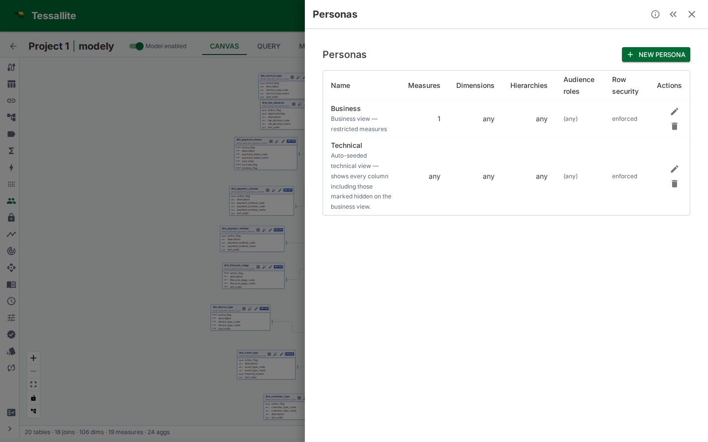
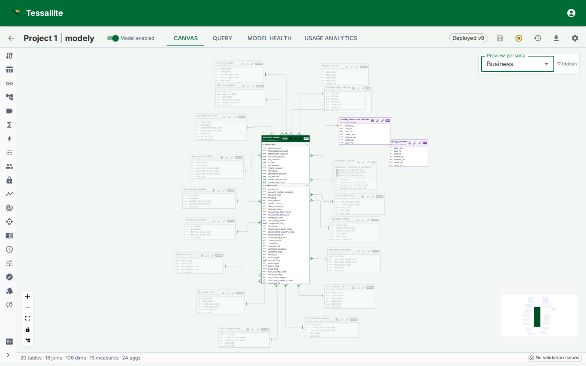

## What a persona is

A **persona** is a named subset of a model. It lists the measures, dimensions, and hierarchies that a given audience is allowed to query, and — optionally — a set of default filters that are merged into every query from that audience.

Row security decides **which rows** a caller sees. A persona decides **which measures and dimensions** they can even ask about. The two are orthogonal and compose: every rule from both layers fires on every query, in that order (persona first, then row security).

Use a persona when one model serves several audiences that should see different parts of the catalogue. Typical cases:

- **Finance vs. Ops.** Both share the same fact, but Finance needs the margin and EBITDA measures; Ops needs utilisation and throughput. A Finance persona includes the finance measures; an Ops persona includes the ops ones. Nobody copies the model.
- **External partner feed.** A partner can see shipment counts and dates but not margins, costs, or internal customer names. A `partner` persona strips the sensitive measures and dimensions out of every query.
- **Compliance-sensitive pilot.** A new calculated measure is under legal review. It lives in the model but is gated behind a `legal_review` persona until sign-off. Regular users never see it.

A model can carry any number of personas. Each is independent. They are never ORed together — a caller is tied to at most one persona, which is chosen by **connecting to that persona's virtual catalog**. The gateway emits one catalog per persona named `<model.slug>_<persona.slug>` alongside the base `<model.slug>` catalog. A seeded `technical` persona per model exposes every column (including hidden ones) as `<model.slug>_technical`, which is the classic modeller view. It is reserved for admins, modellers, and users granted the `model_technical` role (see "Audience roles and persona assignment" below).

---

## The four fields

| Field | Meaning |
|---|---|
| `name` | Human label. Shown in the picker. |
| `description` | Optional free text. Shown as tooltip in the picker. |
| `included_measure_ids` | Allow list of measure IDs. An **empty list means no restriction** — every measure is visible. A non-empty list means **only** those measures are visible. |
| `included_dimension_ids` | Allow list of dimension IDs. Same empty-means-unrestricted rule. |
| `included_hierarchy_ids` | Allow list of hierarchy IDs. Same rule. |
| `default_filters` | A small dictionary of `dimension_path → value` (or `dimension_path → {operator: value}`) **AND-ed into every query**. The caller cannot override these filters. |
| `audience_roles` | List of role names. A caller whose JWT carries one of these roles sees this persona listed in the picker. An empty list means "available to everyone" **only when the persona does not narrow visibility**. A persona with an allow-list, default filters, or column restrictions **must** name at least one role — otherwise save is refused (that combination would lock the tenant). Personas that show hidden columns always need an explicit role match. |

Empty allow lists are the **default** and the most common setting for personas that exist only to attach default filters. Non-empty lists switch that axis into restrictive mode.

### Hierarchy and dimension interaction

Dimensions are governance concepts; hierarchies are presentation objects built from dimensions. When a persona restricts the dimension allow list, any hierarchy level that is backed by an excluded dimension is automatically hidden. If all levels of a hierarchy are hidden, the hierarchy itself disappears from the list.

This means you do not need to maintain both dimension and hierarchy allow lists in lockstep. Restricting dimensions cascades into hierarchies naturally. The hierarchy allow list is still useful for hiding entire hierarchies that are allowed by their dimensions but should not be shown to the audience.

*Figure 1 — The Personas panel. Each row shows the persona's name, description, and a one-glance summary of its allow lists and default filters. The preview-on-canvas action opens the model canvas with this persona pre-selected as a dimmed overlay.*

---

## How the Router applies a persona

Every query — from the gateway, the plugin execution endpoint, or internal REST paths — runs through the persona gate **before** row security and before route selection. The gate runs this four-step procedure:

1. **Resolve the persona.** For gateway queries, the catalog name determines the persona. For the Excel plugin, the `persona_id` field in the request body is used. Embedded users always use the persona set in their token. The server determines the effective persona — the client sends a request, but the server decides.
2. **Check the allow lists.** For each measure in the bound query, confirm its ID is in `included_measure_ids` (or the list is empty). Same for each dimension and hierarchy. The **first** object that falls outside is rejected with a generic `OBJECT_NOT_AVAILABLE` 403 (the error does not name the hidden object).
3. **Merge default filters.** Each `(dimension_path, value)` pair in `default_filters` is **AND-ed** into the query's `WHERE`. The caller's own filter on the same dimension does **not** replace it — both apply. A user cannot widen a persona's mandatory scope.
4. **Proceed to row security.** The persona step does not touch the generated SQL beyond adding filters. Row security then adds its own filter to each table scan in the plan, and the aggregate/pocket fast paths remain available to any candidate that can be proved to carry that filter (see [Configure Row Security](configure-row-security.md), step 4).

The gate runs the same logic for every read path — REST, XMLA, JDBC, Excel plugin, MCP — so swapping tool is not a way around it.

> **Advanced SQL is rejected for scoped personas.** Some SQL shapes — subqueries, CTEs (`WITH ...`), `UNION`/set operations, window functions, and similar constructs — cannot be checked column-by-column against a persona's allow lists, default filters, or column restrictions. When the persona carries any of those controls, such a query is rejected with a clear 403 message instead of being run unchecked. Rewrite it as a plain `SELECT` over the model. Personas with no allow lists, no default filters, and no column restrictions (for example the technical persona) keep full SQL freedom.

> **Tip — hidden columns vs persona allow-lists.** A measure marked **hidden** (`is_hidden`) is dropped from browse lists and from `SELECT *`. Anyone who types the name can still query it. That is curation, not security. To stop a Sales persona from reading cost, put the measure on a persona allow-list (or restrict its column with a data tag). Then both `SELECT fee_amount` and `SELECT SUM(fee_amount)` return `OBJECT_NOT_AVAILABLE`. See [Column-Level Security](column-level-security.md).

---

## Default filters

`default_filters` is a small dictionary keyed by dimension name. Each value is either:

- A **scalar**, e.g. `"fiscal_year": 2026`, which is converted to `dim = 2026`.
- A **list**, e.g. `"region": ["EMEA", "APAC"]`, which is converted to `dim IN (...)`.
- A **dict** with a single operator key, e.g. `{"gte": 100}`, which is converted to `dim >= 100`. Supported operators: `eq`, `neq`, `gt`, `gte`, `lt`, `lte`, `in`, `not_in`, `between`, `like`, `not_like`, `is_null`, `is_not_null`. The list operators use a list value in the dict form — `{"not_in": ["EMEA", "APAC"]}` is converted to `dim NOT IN (...)`. (A bare list is shorthand for `in`; `not_in` must use the dict form so the operator is preserved.)

Conflict rule: if the caller's query already has any filter on the same dimension, the persona's default is **still applied**. Both filters AND together. The user's filter cannot override or drop the persona's mandatory scope.

Unknown operators are ignored silently; the rest of the dictionary still merges. This is deliberate — authoring errors should not block every query from an audience.

---

## Canvas preview overlay

The model canvas has a **Preview persona** picker in the top-right corner (visible only when at least one persona exists). Selecting a persona:

- Dims every table whose measures, dimensions, or hierarchies all fall **outside** that persona's allow lists. Dimmed tables render at 35% opacity in greyscale.
- Dashes every join whose endpoints include a dimmed table.
- Suppresses clicks on dimmed tables and edges. The preview is read-only — the canvas does not change what the model **is**, only what the selected audience would see.

The overlay is the single best way to catch mistakes before publishing. Select each persona in turn and scan for "I didn't mean to hide that".

*Figure 2 — Preview persona overlay. Dimmed tables and dashed joins show exactly what the selected audience cannot reach.*

---

## Audience roles and persona assignment

The `audience_roles` field on a persona controls which users are **assigned** to it. A user is assigned to a persona when their role appears in the persona's `audience_roles` list. An empty list means available to everyone **only when the persona does not narrow visibility**. A narrowing persona (allow-list, default filters, or column restrictions) with an empty audience is refused at save.

**Exception — personas that show hidden columns.** A persona with **Includes hidden columns** turned on (such as the seeded Technical persona) widens what a user can see, so it is never handed out to everyone. It is assigned only to users whose role explicitly appears in its `audience_roles` list. An empty audience list on such a persona assigns it to nobody (admins and modellers can still select it, because they can select any persona).

### The technical persona and the `model_technical` role

Every model carries a seeded **Technical** persona that exposes every column, including hidden ones. It is gated behind the audience role `model_technical`:

- **Admins and modellers** can always pick the technical persona — no extra role needed.
- To give a regular user (for example a data engineer) the technical view, grant them the `model_technical` role: in **Tenant Admin → Users**, set the user's role to `model_technical`, or — for SSO — map one of their IdP groups to `model_technical` in **Group Mappings**. A user with this role is automatically locked to the technical persona on every model.
- The `model_technical` role grants no project permissions by itself. The user still needs a project access binding (viewer, modeler, or admin) to read or edit anything, exactly like a `member`.
- For SSO users whose groups map to several roles, the highest project role (admin > modeler > viewer) wins over `model_technical` at first login. To make such a user a technical-view holder, set their role to `model_technical` directly in user management afterwards.

How persona assignment affects what happens when a user queries:

| Situation | What happens |
|---|---|
| User is assigned to **one** persona | That persona is applied automatically — no selection needed. Selecting a different persona is not allowed. |
| User is assigned to **more than one** persona | The user must select one. Queries without a selection are not allowed. |
| User is **not assigned** to any persona | Everything in the model is available. The user may optionally select any persona as a voluntary filter. |
| **Admin or modeller** | Everything in the model is available. Any persona may be selected optionally. |
| **Technical persona holder** | The technical persona is applied automatically. Selecting a different persona is not allowed. |
| **Embedded user** with a persona set in the token | That persona is always applied. No other persona can be selected. |

The Query Panel, Measure Query Panel, and Excel plugin each show a **Persona** picker that lists the personas the user is assigned to. When only one is assigned, it is pre-selected. When none are assigned, the picker shows all available personas as optional filters.

External BI clients (Excel, Power BI, Tableau) pick a persona by **connecting to its virtual catalog** — the XMLA and JDBC catalog lists include one entry per persona (`<model.slug>_<persona.slug>`) alongside the base `<model.slug>` catalog.

The `audience_roles` list **does not grant project access**. A user still needs to be a member of the project to read the model. Persona assignment only controls which slice of the model catalogue the user sees.

---

## Worked example — Finance, Ops, Partner

**Context.** One wholesale-orders model serves three audiences: the internal Finance team needs margin measures and access to every dimension; the internal Ops team needs utilisation and lead-time measures plus the operational dimensions; the external Partner integration can see shipment counts and dates but none of the cost or customer-identity columns.

**Steps.**

1. Open the model in **Model Builder** → **Personas**.
2. Click **New**. Fill in:
   - **Name:** `Finance`
   - **Description:** `Margin, EBITDA, cost variance — full dimension catalogue.`
   - **Measure allow list:** select `revenue`, `cost`, `margin`, `ebitda`.
   - **Dimension allow list:** leave empty (everything visible).
   - **Default filters:** `{"fiscal_year": 2026}` to scope to the current year by default.
   - **Audience roles:** add `finance_analyst`.
3. Repeat for `Ops` — measures `utilisation`, `throughput`, `lead_time_days`; dimension list empty; audience `ops_manager`.
4. Repeat for `Partner` — measures `shipments_count`, `delivered_on_time_pct`; dimension allow list excludes `customer.internal_id`, `customer.credit_score`, and the margin-only dimensions; no default filter; audience `partner_integration`.
5. Select each persona in the **Preview persona** picker on the canvas and confirm that only the intended tables stay in colour.
6. Issue a test query from the Query Panel as a `partner_integration` user — the Persona picker should show `Partner`, and any attempt to reference a blocked measure should return a 403 `OBJECT_NOT_AVAILABLE`.

---

## Interaction with row security

When both layers are configured:

1. **Persona runs first.** If it denies the object, the query returns 403 before row security is touched.
2. **Persona default filters are added.** These become part of the user's WHERE.
3. **Row security adds its filter to every table scan.** It is added inside each scan, not as an outer wrapper around the finished query, so it always applies before any `LIMIT`. It intersects with the persona defaults — the caller sees rows that satisfy **both**.
4. **Fast paths still run, but under proof.** A persona that only trims the catalogue and adds a default filter leaves aggregates and pockets fully available. When a row-security rule fires, they are not switched off either — each candidate has to prove it can carry the same filter the source scan would carry (see [Configure Row Security](configure-row-security.md), step 4). One that can is used with the filter injected; one that cannot falls back to source.

In practice: personas are cheap, row security is stricter. Use a persona first to trim the catalogue; add row security only when row-level filtering is also needed — and expect a filtered audience to lose the fast path whenever the security column is not materialised in the aggregate's grain or the pocket's copy.

### Bypass row security (Phase 8.C.1)

A persona carries a **Bypass row security** flag. When enabled:

- The Router **skips row-security filtering entirely** for any query bound to this persona — no rule is compiled and no predicate is injected.
- The allow list and audience-role gating **still run**. Per-connection binding still applies.
- Aggregate and pocket fast paths become available **unconditionally**, because with no security predicate to carry there is nothing left to prove. Without bypass they are still available, but only for the candidates that pass the safety proof.
- Every bypassed execution is tagged with `persona_bypass_row_security=true` in the structured request log for audit. There is no dedicated audit table; existing request logs are the audit surface.

Use this only for internal dashboards that are already scoped through persona allow lists and that need the performance of the aggregate/pocket layer. A red warning appears in the editor while bypass is on, and saving with bypass newly enabled requires an explicit confirmation.

### Per-persona aggregates and pockets (Phase 8.C.2 scaffolding)

Aggregates and pockets carry a nullable `persona_id`:

- **NULL** (global) — serves any query, with or without a persona bound.
- **Populated** — serves only queries bound to the same persona.

When a query is bound to persona `X` (through the catalog name), the router prefers a matching aggregate or pocket scoped to `X` over a global one of the same grain. This makes persona-specific workloads (e.g. a partner feed that only ever filters on a narrow slice) a first-class tuning target: the optimizer can build aggregates that are tight to that slice without poisoning global queries with a too-narrow cache.

`query_logs` and `query_miss_logs` now carry `persona_id` as well, so the optimizer can partition its workload scan when building candidates. The matcher precedence rule ships in v1; the optimizer-side scoping that populates per-persona aggregates ships in a follow-on slice.

---

## v1 limitations

| Limitation | Impact | Workaround |
|---|---|---|
| **Empty allow list means "no restriction".** | An editor who intends "nothing is allowed" must explicitly list every object they want hidden, or author the persona as an include list for the single measure that is allowed. | Treat the empty-list case as documentation only. Use non-empty lists to express scope. |
| **Default filters match on dimension name, not ID.** | Renaming a dimension breaks every default filter that references it. | Keep a team-wide convention for dimension names; audit `default_filters` when renaming. |
| **Audience-role matching is union-based.** | A user carrying multiple roles sees every persona that any of their roles advertises. | Keep role strings narrow; avoid multi-audience superuser JWTs. |
| **Per-connection binding ships via catalog name.** | Each persona is a separate virtual catalog (`<model.slug>_<persona.slug>`). External BI tools (Excel, Power BI, JDBC clients) pick a persona by connecting to the matching catalog, not by sending a header. | Point each audience's connection string at the persona catalog intended for it. |
| **Hidden (`is_hidden`) is browse-only.** | A hidden measure still answers if someone types its name. | Use a persona allow-list or a data-tag restriction when the intent is "this audience must not read it". |

---

## Troubleshooting

| Symptom | Likely cause | Fix |
|---|---|---|
| Persona picker is empty for a user who should see one | JWT has no role in the persona's `audience_roles` | Add the role, or edit the persona's audience list. For a hidden-columns persona an empty audience list assigns nobody — add an explicit role |
| Query returns `PERSONA_COMPLEX_SQL_NOT_ALLOWED` | The query uses subqueries, CTEs, set operations, window functions, or similar constructs under a persona with allow lists or default filters | Rewrite the query as a plain `SELECT` over the model, or run it under an unscoped persona |
| Regular user cannot reach the technical persona | The user does not carry the `model_technical` role | Set the user's role to `model_technical` in user management (or via an SSO group mapping) |
| Query returns `OBJECT_NOT_AVAILABLE` unexpectedly | A measure/dimension is not in the allow list, or a column restriction blocks it | Add the object's ID to the list, or remove the list to make that axis unrestricted |
| Default filter does not fire / user cannot override it | Persona defaults are mandatory AND | Expected — remove or change the persona default, not the user's slicer |
| 404 `PERSONA_NOT_FOUND` on every query | The request body carries a `persona_id` that belongs to another model, or the persona was deleted | Check the ID; the router checks `persona.model_id == request.model_id` |
| Persona catalog missing from Excel's database list | Caller's JWT roles do not intersect the persona's `audience_roles`, and the caller is not an admin or modeller | Add the caller's role to `audience_roles`, or grant admin/modeller to allow impersonation |
| Canvas preview shows every table dimmed | The persona's allow lists are non-empty but the model's measure/dim IDs do not match | Re-select measures and dimensions from the canvas-side picker; IDs changed |

---

## Related

- [Configure row security](configure-row-security.md)
- [Define dimensions](define-dimensions.md)
- [Define measures](define-measures.md)
- [Measure query panel](measure-query-panel.md)

---

← [Column-Level Security](column-level-security.md) | [Home](../index.md) | [Parameterized Filters →](parameterized-filters.md)
