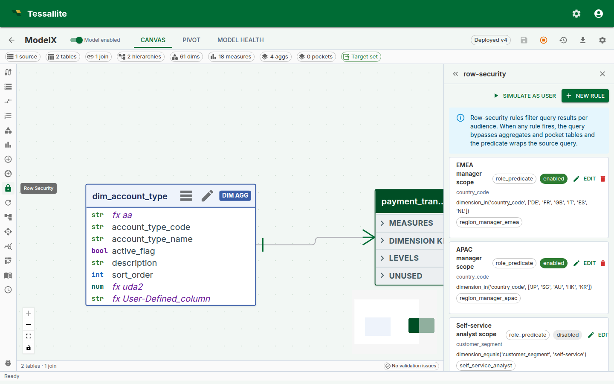
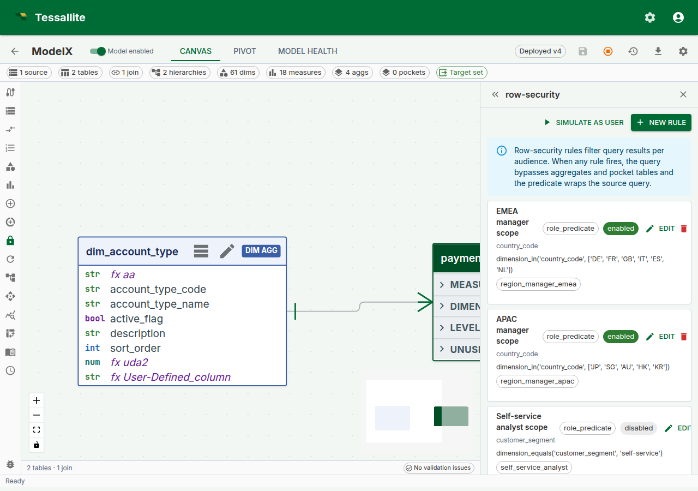
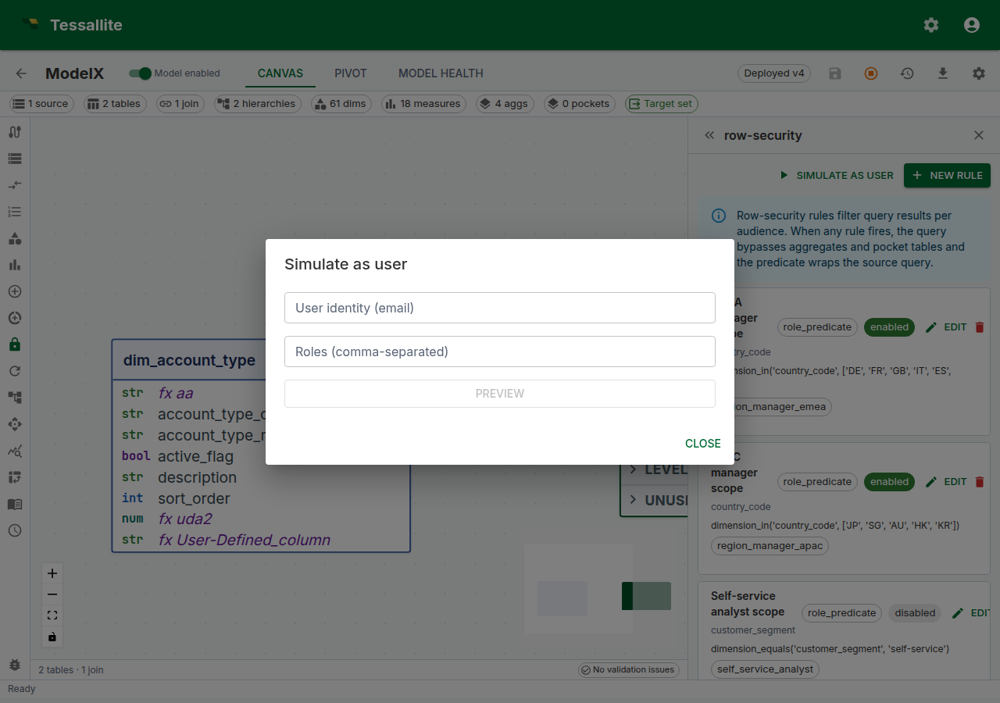

## Why row security matters

The most dangerous numbers in a business are the ones the wrong person sees. A regional sales manager seeing another region's revenue is a compliance incident. A customer-success account manager seeing a colleague's accounts is an HR incident. A "self-service" dashboard that shows every user every other user's data — even once — can cost a contract.

Traditional BI tools solve this by copying the model per audience. Finance gets one cube. Sales Europe gets another. Sales APAC gets a third. Every rename, every new measure, every join change has to be repeated across each copy, and drift between copies is the norm. One model a quarter gets out of step and a region sees something it should not.

**Row security in Tessallite** keeps a single model and filters it at query time per caller. One model, many audiences. The Query Router enforces the filter before any row crosses the network. The filter applies to every read path — JDBC for Tableau, XMLA for Excel, REST for a notebook, MCP for an agent — and cannot be bypassed by switching tool.

This page covers the two rule shapes, the tiny restricted DSL used to author role predicates, how rules combine, how the Router injects the filter at runtime, and the v1 limits every modeller must know before trusting a rule.

---

## When to use row security

The typical cases:

- **Regional sales model shared by regional managers.** Each manager sees only their region.
- **Customer-success model where every account-manager sees their assigned accounts.** Needs per-user scoping, not per-role scoping.
- **Self-service model where the caller should only see rows tagged with their own user identity.** Typical for a HR/performance or personal-finance model.
- **Multi-tenant model inside one workspace**, where the "tenant" is a column on the fact table and the user is a member of exactly one tenant.

When **not** to use row security:

- When two audiences need two genuinely different models (different facts, different grain, different semantics). Copy the model.
- When the visibility rule is based on measure value, not dimension (for example, "hide rows whose revenue is below $X"). Row security filters on dimensions, not on computed values. Use a separate model, or a pre-filtered pocket.
- When the rule is time-varying and changes every query (for example, "only rows older than 30 days"). Row security rules are static predicates; time-relative behaviour lives in the calendar/time-intelligence layer, not the security layer.

*Figure 1 — The Row Security panel. Rules are listed top-down; enabled rules are green-ringed; the protected-dimensions chip row gives the modeller a one-glance audit of what is and is not covered. Full description: [row-security-panel-overview.txt](../assets/screencaps/row-security-panel-overview.txt).*

---

## The two rule shapes

A rule is one of two shapes. A model can mix shapes freely. Named-role grants that match the caller **OR** together (a person with two roles sees the union of those grants). Wildcard `*` rules **AND** with that union as a floor every caller must satisfy. Mapping-table rules also **AND**. Do not write two named-role rules expecting them to intersect for a multi-role user.

### 1. Role predicate

A rule authored in a small restricted DSL, scoped to one or more named roles. Use this when the visibility rule is **the same for everyone in a role**.

| Field | Meaning |
|---|---|
| `name` | Human label for the rule. |
| `dimension_path` | The model dimension the rule filters on, e.g. `region.region_code`. |
| `rule_type` | `role_predicate`. |
| `predicate_expression` | A DSL string, e.g. `dimension_equals('region.region_code', 'EMEA')`. |
| `applies_to_roles` | List of role names. The rule fires only for callers whose JWT carries a matching `role` claim. |
| `is_enabled` | On/off switch. Disabled rules are ignored at query time; they are not deleted. |

The DSL is deliberately tiny so every rule can be reasoned about without running it. Supported forms:

| Form | Meaning | Example |
|---|---|---|
| `dimension_equals(path, value)` | Equality against one dimension column. | `dimension_equals('region.region_code', 'EMEA')` |
| `in(path, v1, v2, …)` | Set membership on one dimension column. | `in('region.region_code', 'EMEA', 'APAC')` |
| `and(expr1, expr2, …)` | All children must hold. | `and(in('region.region_code', 'EMEA', 'APAC'), dimension_equals('year', '2024'))` |
| `or(expr1, expr2, …)` | Any child must hold. | `or(dimension_equals('region.region_code', 'EMEA'), dimension_equals('region.region_code', 'APAC'))` |
| `not(expr)` | Negation. | `not(dimension_equals('region.region_code', 'RESTRICTED'))` |

Anything outside this grammar is rejected at save time with a structured validation error. This is intentional — it means a rule cannot be a back door for arbitrary SQL, and the DSL is identical across PostgreSQL, BigQuery, and future connectors.

String literals are single-quoted. Escape a single quote by doubling it (`'O''Brien'`).

*Figure 2 — Authoring a role predicate. The dimension path field is a dropdown selector populated from the model's defined dimensions; select the dimension the rule filters on (for example `region_code`). The predicate expression field is a multi-line text area where you write the DSL expression; a helper hint below the field reminds you of the supported forms. The applies-to-roles field accepts a comma-separated list of role names. When the rule type is changed to `user_mapping`, the form adapts to show a mapping-table dropdown (populated from the model's tables) and column-name fields instead. Full description: [row-security-rule-drawer.txt](../assets/screencaps/row-security-rule-drawer.txt).*

### 2. User mapping

A rule backed by a mapping table in the same model. Use this when **the visibility rule is per user and the allowed values are stored as data**.

| Field | Meaning |
|---|---|
| `name` | Human label for the rule. |
| `dimension_path` | The model dimension the rule filters on. |
| `rule_type` | `user_mapping`. |
| `mapping_table_id` | A `ModelTable` in the same model holding `(user_identity, allowed_value)` rows. |
| `mapping_user_column` | Physical column on the mapping table that stores the user identity. |
| `mapping_value_column` | Physical column on the mapping table that stores the allowed dimension value. |
| `is_enabled` | On/off switch. |

Cross-model mapping tables are rejected at save time — a rule on model A cannot draw allowed values from a table that belongs to model B. This prevents accidental cross-tenant leaks.

A user with **multiple rows** in the mapping table — for example, an account manager mapped to three accounts — sees the **union** of those values. No additional configuration is needed.

The mapping table is just another model table, and it must belong to the same model as the rule. It can live in the same schema as the facts, or in a separate "security" schema, as long as that schema sits on the same data source as the facts it protects.

It cannot usefully live on a genuinely different data source. A model can be built by joining more than one source together — for example, a PostgreSQL source joined to a BigQuery source — and the rule form lets you pick a mapping table from any source in the model when you save the rule. But the moment a query actually needs that rule, Tessallite checks whether the mapping table and the fact table it filters share a source. If they do not, the query is refused with a clear error rather than silently joining rows across two different databases. Keep the mapping table on the same source as the fact table it protects.

---

## How the Query Router applies rules at runtime

For every read query, the Query Router runs the same four-step procedure:

1. **Resolve the principal.** The caller's `Principal` is extracted from the JWT: `user_identity` from the `sub` / `email` claim, `roles` from the `role` claim. A single-string role is treated as a one-element frozen set so both `role: "manager"` and `role: ["manager"]` JWTs work.
2. **Compile every matching enabled rule.** Every role predicate whose `applies_to_roles` intersects the principal's roles. Every user mapping rule (these always match once per user). Disabled rules are skipped.
3. **Constrain every table scan.** If at least one rule compiled, the Query Router adds the combined predicate to the `WHERE` of *every* SELECT that reads a physical table — not as an outer wrapper around the whole query, but inside each scan. That includes each branch of a `UNION` / `EXCEPT` / `INTERSECT`, scalar subqueries, subquery-first `FROM` clauses, and the bodies of CTEs. Two consequences matter:

   - Because the filter lives in the *same* SELECT as each scan, it always applies **before any `LIMIT`**. So `LIMIT 100` returns up to 100 *allowed* rows — never the first 100 physical rows that are then filtered down to far fewer (or none).
   - The combined predicate is `AND(each wildcard, OR(named grants), each mapping)`. Two named-role grants for a caller who holds both roles **union**. A wildcard plus a named grant **intersects**. Mapping-table rules always intersect.

   A query whose shape the Router cannot prove it has fully constrained — one it cannot parse, or whose scopes it cannot resolve — is **rejected** with a `403` and the error code `row_security_unsupported_shape`, rather than being run unfiltered. Rewriting it as a plain SELECT (or a UNION of plain SELECTs) over the model resolves it. This fail-closed stance is the whole point: an unconstrainable query is refused, never leaked.

4. **Use a fast path only when it can be proved safe.** Tessallite keeps pre-computed copies of your data — aggregates and pocket tables — to answer common questions quickly. When a row-security rule fires, the Router does not simply skip them, and it does not simply trust them either. It asks one question per candidate: *can this shortcut carry the exact same filter the source scan would carry?*

   - An **aggregate** passes only when every column the security rule filters on is one of the columns that aggregate is grouped by. If the aggregate was pre-summarised in a way that threw the security column away, there is no honest way to filter it, so it is rejected.
   - A **pocket table** passes only when it is a straight copy of the rows (a `SELECT *`-style copy, optionally with its own WHERE filter — no joins, no grouping, no picked column list, no row limit) *and* Tessallite's own record of what that copy physically contains shows the security column is really there, spelled exactly the same way. That record is written every time the pocket is rebuilt, by reading the built table back from the database — it is never guessed from the model's design. A pocket copies only the columns its build made visible, so a hidden or joined-in security column can be genuinely missing from a perfectly valid pocket.

   When a candidate passes, the identical filter is added to each scan of that pre-computed table, so it is narrowed exactly as the source would have been — filtering only ever removes rows, never adds them. When a candidate cannot be proved, the query falls back to the source. **The proof is re-checked one more time, against a fresh read, in the instant before the table is scanned**, so a rebuild that lands mid-request is refused rather than served. Nothing unproved is ever read: this is a correctness guarantee first and a performance feature second.

When **no rule matches**, ordinary callers receive a deny-all predicate and see no rows. Only trusted interactive platform roles (`tenant_admin`, `modeler`, and `system_admin`) are exempt so administrators can inspect and repair governed models. A rule that explicitly names one of those roles still filters it. The KPI service role and bare embed sessions are not exempt.

---

## Preview compiled policy

The Row Security panel has a button labeled **Simulate as user**. It opens a dialog where you enter a candidate email address and a list of roles, then click **Preview**. Tessallite compiles every enabled rule against that hypothetical person and shows the resulting filter — one compiled string, the same predicate the Query Router would inject. There is no per-rule fire / not-fire tree: unmatched named grants simply do not appear in that string.

Optionally fill **Probe query** (the panel suggests `SELECT <security_column>, COUNT(*) FROM <model> GROUP BY <security_column> LIMIT 50`). When a tenant administrator supplies a probe, Simulate runs it through the real `/execute` path and shows the rows that principal would see. A modeller who is not a tenant administrator still gets the compiled predicate; the probe is refused rather than silently ignored. A blank probe is compiled-preview only.

*Figure 3 — Preview compiled policy. Confirming a rule's effect before sending a JWT to a user's tool is the single highest-value habit in row-security authoring. Full description: [row-security-simulate-drawer.txt](../assets/screencaps/row-security-simulate-drawer.txt).*

The compiled string is a policy check. The probe table is the row proof. Review both after every rule change — named grants OR, so two rules that look like they tighten can instead widen a multi-role caller.

---

## Worked example — a two-region model

**Context.** A company has two regional sales audiences — EMEA and APAC. Each manager should see only their region's rows. A third group, "central analytics", should see every region.

**Steps.**

1. Open the model in **Model Builder** → **Row Security**.
2. Click **New Rule**. Fill in:
   - **Name:** `EMEA manager scope`
   - **Rule type:** `role_predicate`
   - **Dimension path:** `region.region_code`
   - **Predicate expression:** `dimension_equals('region.region_code', 'EMEA')`
   - **Applies to roles:** add `region_manager_emea` as a chip.
   - **Enabled:** on.
3. Save. Add a second rule mirroring the first for APAC (`dimension_equals('region.region_code', 'APAC')`, role `region_manager_apac`).
4. Add an explicit central-analytics rule covering every allowed region. An ordinary unmatched `analytics_central` role is denied every row.
5. Open **Simulate as user**, enter `analyst@acme-demo.com` with role `region_manager_emea`, and click **Preview**. The compiled string should constrain the region to EMEA. The APAC grant is simply absent from that string (the panel does not grey out unused rules).
6. Preview again with a user who has no roles. The compiled string should be deny-all (`0 = 1`). Then preview a tenant administrator: the compiled predicate is empty because privileged unmatched roles are exempt, not because the model is unprotected. Do not use `admin@acme-demo.com` as the everyday JDBC/Excel user when you want to see France-manager rows.

---

## v1 limitations

| Limitation | Impact | Workaround |
|---|---|---|
| **Every scanned table must expose the security dimension column.** The Router ANDs the predicate (referenced by the path's last segment, e.g. `region.region_code` → `region_code`) into the WHERE of every SELECT that reads a physical table. | If a scanned scope does not expose that column, the source database rejects the query with "column does not exist" — it fails **closed**, never returning unfiltered rows. Query shapes the Router cannot safely constrain are rejected with a `row_security_unsupported_shape` error. | Ensure the fact table exposes the security column, or rewrite the query as a plain SELECT (or a UNION of plain SELECTs) over the model. |
| **Aggregate and pocket fast paths are used under row security only when they can be proved safe.** An aggregate needs every security column in its grouping; a pocket needs to be a straight row-preserving copy whose recorded materialised columns include every security column, matched exactly (including upper/lower case). | A filtered audience gets the fast answer when the proof holds and the source-speed answer when it does not — never a wrong or unfiltered one. A pocket that drops or renames the security column, or whose column record is missing or out of date, quietly routes to source. | If a filtered audience is slower than you expect, check that the security dimension column is actually materialised in the aggregate's grain or the pocket's copy, spelled identically. A per-audience pre-filtered pocket is still a good option when the general artifact cannot carry the column. |
| **Roles are strings carried on the JWT.** No central role registry today. | Typos in `applies_to_roles` silently match nothing. | Keep a canonical list of role strings in the team's runbook; a planned rule-coverage audit will highlight orphaned roles. |
| **One security dimension per rule.** A rule filters on exactly one `dimension_path`. | Compound restrictions need more than one rule. | Author a wildcard (AND floor) plus named grants (OR entitlements), or a single `and(...)` DSL expression. Named grants for a multi-role user union; they do not intersect. |
| **Embed sessions apply row-security rules only when the embed token carries a security subject.** When you mint an embed token you can set an `rls` subject — a role, a set of groups, and/or a set of claims — for the end user the token represents. That subject drives `role_predicate` / `idp_group` / `saml_claim` / `oidc_scope` rules exactly like an ordinary sign-in does. If you leave the subject off, the embedded view carries no role/group/claim. | On a model that has row-security rules, an embed token **without** a matching subject is denied every row (it fails closed) — it never sees the unrestricted set. | Set the `rls` subject on the embed token to the role/groups/claims the end user should be filtered by. Embed persona default filters still apply as an additional layer. |
| **Visual rule builder (predicate tree, a canvas-wide preview overlay, and a coverage audit) is planned for a future release.** | Current authoring uses model-aware dropdown selectors for dimension and mapping table, but the predicate expression is a free-text DSL editor. | The DSL is small; the form validates as you type; Preview gives the round-trip check. |

---

## Demo and simulation data

The `acme-demo` tenant seeds row-security rules. After a current reseed, regional-manager predicates use the compilable `in(...)` form (not the retired `dimension_in`). Live tenants that were never reseeded can still hold uncompilable text — Simulate and `/execute` then return a typed 422, not unfiltered rows.

`admin@acme-demo.com` is a tenant administrator. Privileged unmatched roles are exempt from coverage deny-all, so that JDBC/Excel login sees every region, including ones a France manager must not see. Use Simulate with role `region_manager_emea` (and a probe query) to inspect restricted rows. A dedicated non-privileged demo JDBC user is a seed follow-up.

To reseed the demo tenant (including its row-security rules), run `bash scripts/reseed_acme_demo.sh` from the `tessallite/` directory.

---

## Troubleshooting

| Symptom | Likely cause | Fix |
|---|---|---|
| Rule saves but no filtering happens | Role in `applies_to_roles` does not match the JWT's `role` claim | Check the JWT; keep role strings canonical |
| Query errors with "column does not exist" for the security column | A scanned scope does not expose the security dimension column the rule references | Ensure the fact table exposes the column (the filter fails closed rather than returning unfiltered rows) |
| Query rejected with `row_security_unsupported_shape` | The query shape cannot be safely constrained by the active rules | Rewrite it as a plain SELECT, or a UNION of plain SELECTs, over the model |
| Simulate compiled string is deny-all (`0 = 1`) for the target user | User's roles do not include any `applies_to_roles` from a named grant, and no wildcard matches | Add the role to the user's JWT claim, or the role name to the rule |
| Two users in the same role see different rows | The rule is `user_mapping`, not `role_predicate` — and the mapping table's allowed values differ per user | Expected. Use `role_predicate` if per-role scope is needed |
| User mapping rule returns zero rows for a valid user | Mapping table has no row for that user | Add a row, or fall back to a role-predicate rule for users without mapping rows |

---

## Related

- [Define dimensions](define-dimensions.md)
- [Configure aggregates](configure-aggregates.md)
- [Configure pocket tables](configure-pocket-tables.md)
- [View diagnostics](view-diagnostics.md)

---

← [Usage Analytics](usage-analytics.md) | [Home](../index.md) | [Data Tags →](data-tags.md)
