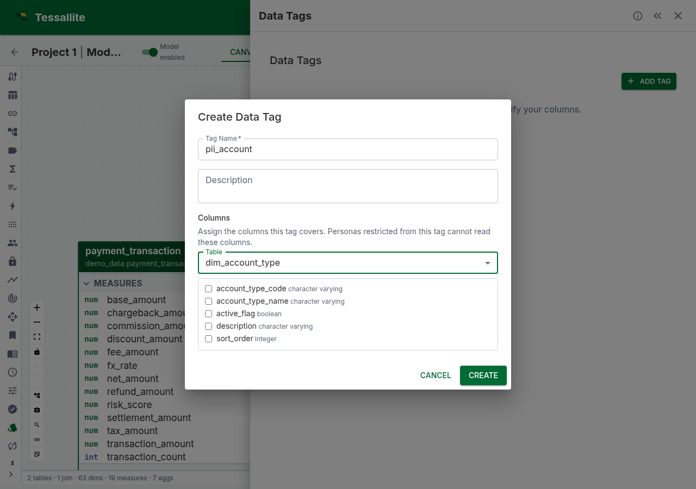

## What this covers

Data tags are user-defined labels that group columns by sensitivity, category, or business domain. Tags serve two purposes: they document which columns carry sensitive data (making models auditable), and they drive column-level access control when combined with persona restrictions (see [Column-Level Security](column-level-security.md)). This article explains how to create, assign, and manage data tags.

---

## Before you start

- You need at least one model with tables and columns added. See [Add Tables to a Model](add-tables-to-a-model.md).
- Tags are model-scoped. Each model has its own tag namespace.

---

## What data tags are not

Tags are for access control and governance, not data classification. They tell Tessallite "this column is PII" so the platform can restrict it — they don't tell the data lake "this column is PII" for compliance scanning. Classification belongs at the source; tagging belongs at the semantic layer.

---

## Creating a tag

1. Open the **Data Tags** panel in Model Builder (Toolbelt sidebar).
2. Click **Add Tag**.
3. Enter a **tag name** (e.g. `PII`, `Financial`, `Internal Only`).
4. Optionally enter a **description** explaining what the tag means and who should have access.
5. Assign columns in the **Columns** section (you can also do this later — see below).
6. Click **Create**.

---

## Assigning columns to a tag

1. In the Data Tags panel, click the edit (pencil) icon on the tag — or do this while creating it.
2. In the **Columns** section of the dialog, choose a **Table** from the dropdown.
3. Tick the columns the tag should cover. Each assigned column appears as a chip labelled `table_name.column_name`; click the chip's × to remove it.
4. Repeat with other tables if the tag spans more than one.
5. Click **Update** (or **Create**). The tagged columns now show a tag chip in the table editor's **Attributes** tab.

You can assign the same column to multiple tags (e.g. `customers.email` could be both `PII` and `Contact Info`).

---

## Grouping strategy

Choose a tagging strategy that matches your governance model:

| Strategy | Tags | Best for |
|---|---|---|
| By sensitivity | `PII`, `Sensitive`, `Financial`, `Public` | Regulatory compliance (GDPR, HIPAA) |
| By audience | `External`, `Internal`, `Executive` | Role-based access in multi-persona models |
| By domain | `Customer`, `Product`, `Finance` | Large models with cross-functional teams |

Whichever strategy you choose, apply it consistently. Mixed strategies make persona restrictions harder to reason about.

---

## Viewing tags in the model

Tagged columns display a small tag chip next to the column name in the table editor's **Attributes** tab (double-click a table on the canvas to open it). The lineage graph shows a "N tagged cols" count on semantic nodes that have tagged columns. The Data Tags panel itself lists every tag with its assigned columns — expand a tag row to see them.

---

## Best practices

- **Tag new columns promptly.** Untagged columns are visible to all personas by default. If you add a new column to a tagged table, remember to tag it if it contains sensitive data.
- **Use descriptive tag names.** `PII` is better than `Tag1`. The name appears in persona restrictions, audit logs, and tag chips.
- **Review tags when the model changes.** Source schema drift may add columns that need tagging. Run schema refresh, then review untagged columns.

---

## Related

- [Column-Level Security](column-level-security.md)
- [Configure Personas](configure-personas.md)
- [Configure Row Security](configure-row-security.md)

---

← [Configure Row Security](configure-row-security.md) | [Home](../index.md) | [Column-Level Security →](column-level-security.md)
