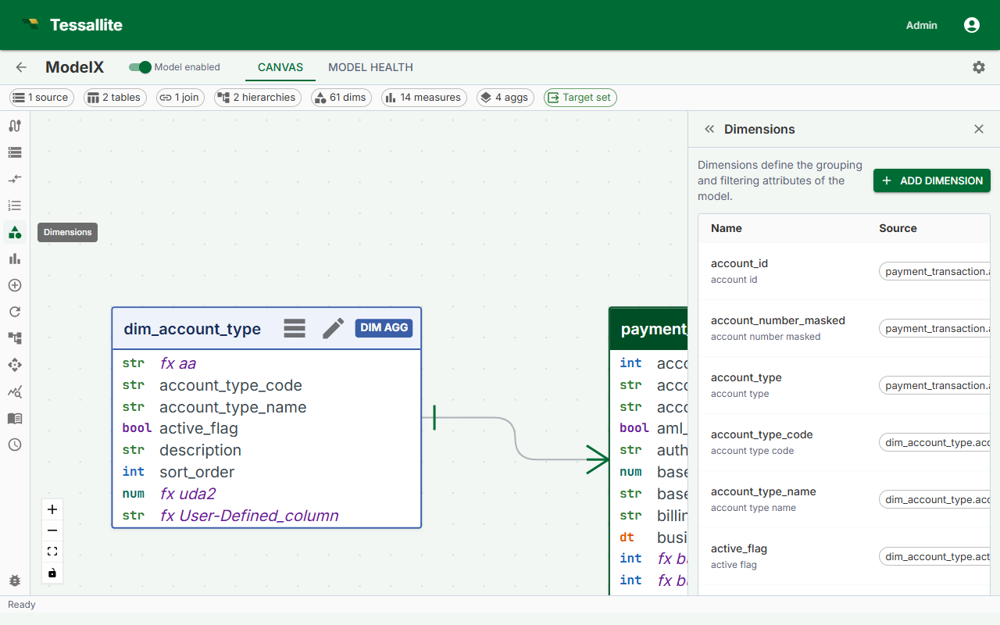

## What this covers

A dimension is a named grouping attribute that maps a business-friendly label to a specific source column. Dimensions appear as columns in the virtual schema that BI tools query. This article explains dimension fields, the definition flow, naming conventions, and what happens when a dimension references a column that no longer exists.

---

## Before you start

- All tables containing the columns you want to use as dimensions must be added to the model. See [Add Tables to a Model](add-tables-to-a-model.md).
- Tables that are not the fact table must be connected to the fact table by a join path. See [Define Joins](define-joins.md).

---

## What a dimension is

A dimension maps a business name to a column in the model's source tables. For example, `orders.status_cd` might be exposed as a dimension named `Order Status`. BI tools see `Order Status` as a queryable column in the model's virtual schema.

Dimensions can come from any table in the model -- fact tables, dimension tables, or any other joined table. Which table a dimension belongs to affects whether it can participate in aggregate routing (dimensions on tables included in the aggregate grain) or whether queries using it are served from raw source data.

---

## Dimension fields

| Field | Required | Description |
|---|---|---|
| Name | Yes | Unique identifier for this dimension in the model schema. Business-friendly, title case. |
| Source table | Yes | The table in the model containing the column. |
| Source column | Yes | The column in the source table. This column provides the key value (the unique identifier for each member). |
| Display column | No | A second column from the same table whose values are shown as the member caption in BI tools, while the source column stays the underlying key. For example, `customer_id` as the source column and `customer_name` as the display column. When blank, the source column value is used for both key and caption. |
| Display name | No | Alternate label for BI tools that support display names. Defaults to Name if blank. |
| Description | No | Free-text explanation shown in model metadata and some BI tool tooltips. |
| Default sort order | No | ASC or DESC. Controls default sort when an analyst orders by this dimension. |

---

## Steps

1. Open the Model Builder for the project.
2. Select a table in the Canvas, or click **Add Dimension** in the Toolbelt. The Drawer opens with the dimension form.
3. If you used the Toolbelt button, select the **Source table** from the dropdown first.
4. Select the **Source column** from the list.
5. Enter a **Name** using business terminology — for example, `Sale Date` rather than `sale_dt`.
6. Optionally fill in **Display name**, **Description**, and **Default sort order**.
7. Click **Save**. The dimension count in the Summary Bar increments by one.

---

## Example dimensions

| Dimension name | Source table | Source column | Display column | Notes |
|---|---|---|---|---|
| Sale Date | `dim_date` | `date_actual` | -- | From a date dimension table. Can serve as an aggregate grouping key if included in the aggregate grain. |
| Product Category | `dim_product` | `category_name` | -- | From a dimension table. Enables pre-aggregation by category when included in an aggregate grain. |
| Order Status | `orders` | `status_cd` | -- | From the fact table itself. Valid for filtering or grouping. |
| Customer | `dim_customer` | `customer_id` | `full_name` | Uses `customer_id` as the key and `full_name` as the display caption. BI tools show the name while queries filter on the id. |

---

## Attribute relationships

After creating a dimension, you can declare **attribute relationships** to tell Tessallite that another column is functionally dependent on this dimension's key. For example, if every `customer_id` always maps to exactly one `customer_name`, `customer_email`, and `customer_region`, you can declare those as attributes of the Customer dimension.

Attribute relationships serve two purposes:

- **Query routing.** When Tessallite knows that `customer_region` is determined by `customer_id`, it can serve queries that group by region from an aggregate that was built at the customer-id grain, without falling through to raw data.
- **Model clarity.** The relationship makes the one-to-one dependency explicit in the model, so anyone reading the model can see which columns belong together.

To add an attribute relationship, open a dimension in the Model Builder, scroll to the **Attribute Relationships** section, and click **Add Relationship**. Select the detail column and save. The relationship is stored as model metadata and verified at deploy time.

---

## Naming conventions

- Use business terminology, not database column names.
- Use title case: `Order Status`, not `order_status` or `ORDER_STATUS`.
- Avoid abbreviations that are not universally understood in your organization.
- Names must be unique within the model. Differentiate similar concepts explicitly: `Ship Date` vs `Order Date`.

---

## How dimensions appear to BI tools

When a model is published, each dimension appears as a column in the model's virtual schema. BI tools connecting over JDBC see the workspace slug as the database name, the model name as the schema name, and each dimension as a queryable column. Analysts can GROUP BY, filter on, or ORDER BY any dimension column.

---

## If a dimension references a missing column

If the source column is renamed or dropped after the dimension is defined, the dimension becomes invalid. The Health tab shows an error identifying the affected dimension and missing column. The model cannot be published while errors are present. Edit the dimension to point to the correct column, or delete it if the column has been removed permanently.

---

## Related

- [Dimensions and Measures](../concepts/dimensions-and-measures.md)
- [Define Joins](define-joins.md)
- [Define Measures](define-measures.md)

---

← [Define Hierarchies](define-hierarchies.md) | [Home](../index.md) | [Dimension Aliases →](dimension-aliases.md)
