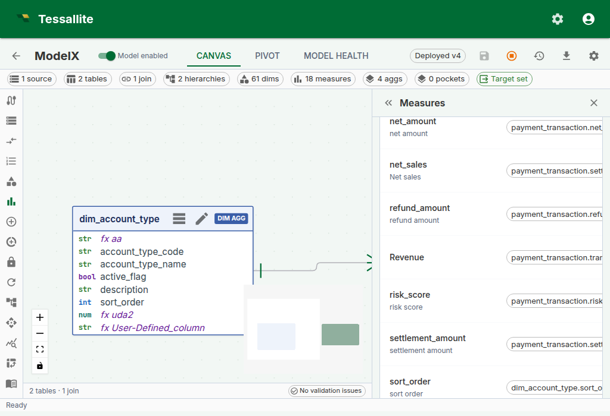
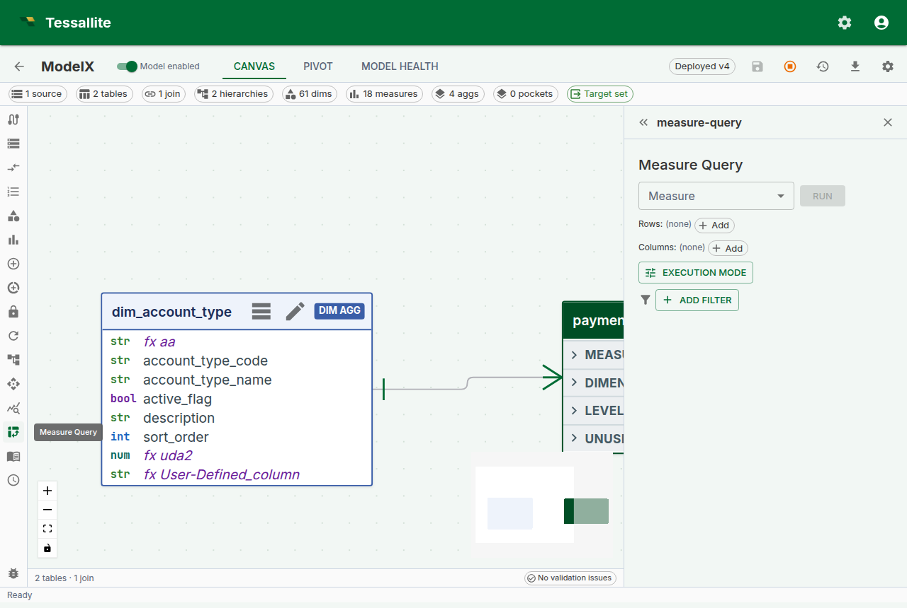
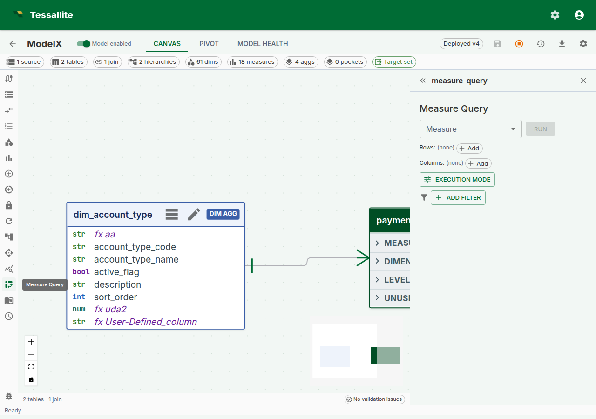

## Why drill-through matters

Every number on every dashboard is a question waiting to be asked. "Revenue for EMEA in Q2 is €4.8M — great, but which orders made up that number?" Without drill-through, answering that question is an IT ticket, a SQL session, and a three-day wait. With drill-through, it's one click.

Drill-through in Tessallite is the bridge from a single aggregated cell to the raw fact-table rows behind it. It answers three questions a business reader always has and should not need to re-ask:

1. **Which rows actually contributed to this number?** (The auditability question.)
2. **Are any of those rows wrong or surprising?** (The trust question.)
3. **Can I export just the rows behind this cell?** (The "build the follow-up deck" question.)

This page explains how drill-through is configured per measure, what exactly comes back when you click a cell, how pagination works so you never freeze the browser on a 10-million-row export, the decomposed drawer used for calculated measures, and the current limits the modeller needs to know.

---

## How drill-through is configured

Drill-through is **not a separate feature you enable**. Every standard measure gets a **drill-through set** automatically the moment it is saved. The set is a tiny configuration object attached to the measure that records four things:

| Field | What it controls | Default |
|---|---|---|
| **Source fact table** | The fact table the measure aggregates. Modellers can override with a finer-grained sibling table; Tessallite asks them to pick a join path back to the original fact when more than one exists. | Auto-detected from the measure. |
| **Detail columns** | Which dimension-backed columns of the source table are returned when drilling. Only columns that are exposed as a dimension on the model can be projected. | The cell's grouping dimensions — the dimensions that identify the clicked cell. |
| **Joined dimensions** | LEFT-JOINs human-readable dimension columns into the drilled rows. Each joined dimension is projected under its own dimension name (`customer_name`, `product_category`); there is no automatic prefix. | Empty. |
| **Row-limit override** | Caps the page size at a custom value; otherwise the global default applies. | Unset (default 1 000, cap 10 000). |

The reason configuration exists is control in both directions. By default a drill returns only the cell's grouping dimensions — the dimensions that identify the number you clicked — so you see the contributing breakdown without exposing anything else. Curation lets the modeller **add** detail: extra dimension-backed columns from the source table, or human-readable columns LEFT-JOINed in from a dimension table. It also lets them keep the projection tight when a fact carries columns no drill-through consumer should see: internal IDs, PII, audit timestamps that confuse rather than help. The full curation workflow, with all four controls and worked business examples, is documented in [Curate drill-through](curate-drill-through.md).



*Figure 1 — Drill-through configuration on a measure. Leave it at default to return the cell's grouping dimensions. Add detail columns or joined dimensions when the analyst needs more than the breakdown; tighten the list when the fact has PII or noise columns. Full description: [drill-through-config-drawer.txt](../assets/screencaps/drill-through-config-drawer.txt).*

---

## What comes back when you click a cell

A drill-through call returns a structured response the frontend renders as a table:

- **`columns`** — the ordered list of column names. The frontend uses data types inferred from the values to right-align numerics and parse dates.
- **`rows`** — each row is a dictionary keyed by column name. Values come back typed (numbers as numbers, not strings) so the browser does not re-parse them.
- **`page`** — three opaque pagination fields: `cursor` (where the current page starts), `next_cursor` (what to send for the next page), `has_more` (is there another page).
- **`drill_mode`** — either `"hierarchy"` (the result is one level of a dimension hierarchy, and the user can drill deeper) or `"leaf"` (the result is fact-table detail rows with no further drill-down available).
- **`drill_dimension`** — when `drill_mode` is `"hierarchy"`, identifies the dimension being drilled (its `id`, `name`, and `display_name`). Null for leaf-mode drills.
- **`hierarchy_path`** — a list of entries recording the levels already traversed to reach the current drill position. Each entry carries a `level_name`, `dimension_name`, and the `value` at that level. Empty on a fresh leaf drill.
- **`drillable_hierarchies`** — a list of hierarchies the user can drill into next from the current position. Each entry carries `hierarchy_id`, `hierarchy_name`, `current_level_name`, and `next_level_name`. The frontend uses this to render "drill into..." options on the result.
- **`fact_table`** — the physical name of the fact table the rows came from (leaf mode only). This is surfaced for transparency — there is no middleware reassembling rows from multiple sources.
- **`route_type`** — the execution route that served this drill (for example `"source"` or `"aggregate"`), displayed in the Route badge.
- **`execution_ms`** — wall-clock milliseconds the drill query took to execute.
- **`bytes_processed`** — bytes scanned by the source engine (where the connector reports it; zero otherwise).
- **`rows_returned`** — total row count in this page of the result.

Rows are ordered by every projected column on each call — the detail columns first, then the measure value. A **strict total order is required before Tessallite offers a second leaf page**. Every component of the fact table's primary key must be exposed as a dimension; Tessallite appends that complete tuple in canonical schema order. A partial composite key is not unique. When any component is missing and the result exceeds one page, the endpoint returns `STABLE_CURSOR_UNAVAILABLE` instead of risking repeated or skipped rows.

Filter values are never spliced into the SQL as raw text. Each value is turned into a typed SQL literal by the query compiler (numbers as numbers, strings as quoted-and-escaped strings, nulls as `IS NULL`), and the whole statement is then re-parsed, bound to the semantic model, and security-checked before it reaches the database. A fact table with a column named `"; DROP TABLE orders; --` is handled as an ordinary identifier — the crafted text never escapes its quotes.



*Figure 2 — Where drill-through starts. Build and run a measure query in this panel; after the result grid appears, select a measure cell to show its detail rows inline below the grid. Full description: [drill-through-drawer.txt](../assets/screencaps/drill-through-drawer.txt).*

For a standard measure, clicking a cell now renders the drill-through result **inline, directly below the pivot grid** in the same result panel, rather than sliding a separate side panel in from the right. Use the close (X) control in the panel header to dismiss it. (Calculated measures still open the decomposed drawer described below, because they stack one mini-panel per referenced base measure.)

---

## Calling the endpoint directly

The inline result panel is the common path, but drill-through is also a stable REST endpoint so a notebook, a Slack bot, or an MCP agent can call it without a UI.

```
POST /api/v1/measures/{measure_id}/drill-through
{
  "filters": [
    { "column": "country", "op": "eq", "value": "DE" }
  ],
  "grouping_levels": [
    { "column": "quarter", "op": "eq", "value": "2024-Q2" }
  ],
  "cursor": null,
  "limit": 500
}
```

`filters` and `grouping_levels` both become `WHERE` predicates. The distinction is semantic:

- **`grouping_levels`** carries the coordinates of the cell you clicked — the dimension values that identify the pivot position. In a pivot with `region` on rows and `quarter` on columns, a click on the EMEA / Q2 cell posts `grouping_levels: [{region: "EMEA"}, {quarter: "2024-Q2"}]`.
- **`filters`** carries any additional global constraints the caller wants to impose on top — for example, a slicer that is set to "only completed orders".

Keeping these separate in the payload (rather than collapsing both into one filter list) matters because the Query Router can validate grouping levels against the model's dimensions before executing — a drill with `grouping_levels: [{not_a_real_dimension: "x"}]` fails with a structured error instead of reaching the database.

**Supported operators** for both: `eq`, `neq`, `gt`, `gte`, `lt`, `lte`, `like`, `ilike`, `in`, `between`, `is_null`, `is_not_null`. Each is compiled to the matching SQL predicate — an unrecognised operator is rejected with `DrillThroughUnsupportedOperator`, and a wrong operand shape (an `in` without a list, a `between` without two bounds) with `DrillThroughBadOperand`. Operators are never silently downgraded to equality. `in` takes a list value; `between` takes a `[low, high]` pair; `is_null` / `is_not_null` take no value.

---

## Pagination

Drill-through uses a signed, opaque keyset cursor that the caller passes back unchanged to fetch the next page. The cursor records the final row's complete ordering key and is bound to the tenant, project, deployed model version and epochs, measure, coordinates, filters, page size, route override, persona, and security principal. Inserts or deletes before the current position therefore do not shift the next page. A tampered cursor returns `INVALID_CURSOR`; a cursor from changed scope returns `STALE_CURSOR` with HTTP 409 so the caller restarts from the first page. If the complete signed key would exceed 16,384 characters, the endpoint returns HTTP 409 `CURSOR_TOO_LARGE` instead of emitting a token the next request must reject.

Use it like this:

1. First call: `cursor: null, limit: 500`. The response comes back with `next_cursor: "<opaque-string>"` and `has_more: true`.
2. Second call: pass the `next_cursor` from the previous response back as `cursor`.
3. Keep going until the response returns `next_cursor: null` and `has_more: false`.

The cursor is opaque by design. Do not parse or edit it. Reuse it only with the same request and security context.

The per-page limit is clamped at 10 000 rows. The default is 1 000. If you need more than that in one shot, consider whether you really need every row in the browser — drill-through is for investigation, not bulk export. For bulk export, see the CSV/JSON export buttons on the Measure Query Panel grid.

---

## Exporting the rows behind a cell

The drill-through panel has its own **Export current page to CSV** button. It exports exactly the rows currently shown — the page you are looking at, with the columns you have visible — **not** the entire result set behind the cell. The button label and the downloaded file name both say "current page" on purpose, so a page export is never mistaken for the complete set. If a drill spans many pages and you need all of it, use the pivot grid's CSV/JSON export on the Measure Query Panel instead, which is built for bulk export.

**Drilling straight to the live source.** With **Force Live** switched on, the drill-through itself reads from the source as well, not just the pivot above it (the drill request is sent with the route forced to `source`). That lets you click into a cell and see the live source rows behind it directly — the fastest way to confirm whether an aggregate is stale, because you are comparing the accelerated number against the source detail in one step.

---

## Drill-through on calculated measures

Calculated measures have no single source column, so a straightforward drill-through query would not know which fact table to scan. Since Phase 6 (2026-04-24), clicking a calculated-measure cell opens a **decomposed drill drawer** that handles this by running one drill-through per referenced base measure and stacking the mini-panels.

The drawer shows:

1. A read-only **calculated-value card** at the top with the cell's value and the raw expression, so you can always see what you are drilling into.
2. One **mini drill-panel per referenced base measure**. Each panel is a self-contained drill-through surface with its own 50-row pagination — so you can walk the numerator rows and the denominator rows independently without one disturbing the other.

This trades "one table of rows" for "one table per base measure". In exchange, analysts can answer the follow-up question that otherwise requires running two separate queries: "what are the rows behind the numerator, and what are the rows behind the denominator, for exactly this cell?"



*Figure 3 — A calculated measure's decomposed drill drawer. The numerator and denominator panels paginate independently. Full description: [drill-through-calc-decomposed.txt](../assets/screencaps/drill-through-calc-decomposed.txt).*

---

## When drill-through is not available

Drill-through is deliberately **not** offered for:

- **Composite or multi-fact measures** — a v1 simplification. A measure that aggregates across two joined fact tables has no single "source fact" to drill into; the composite drill-through case will be specified in a future phase.

Drill-through has **no connector-specific restriction**. It runs through the same rewrite-and-execute pipeline as every other query — the SQL is transpiled to the connector's dialect and executed through the source gateway — so any source your model can query, it can drill. There is no gate that switches drill-through off for particular sources.

Calculated measures are handled differently — clicking one opens the decomposed drawer (below) rather than erroring. For the composite / multi-fact case the inline panel opens with a structured error whose payload carries a stable `error_code` so an integration can branch on the code rather than parsing the message string. See the error-code reference below for the actual codes the endpoint returns.

---

## Worked example — trace a suspicious revenue number

**Context.** A dashboard shows EMEA Q2 revenue at €4.8M. Finance thinks it should be closer to €5.2M. The analyst wants to find the missing ~€400K without waiting for IT.

**Steps.**

1. Open the [Measure Query Panel](measure-query-panel.md). Pick `Revenue` as the measure, `region` on rows, `quarter` on columns. Click **Run**.
2. Click the cell at row `EMEA`, column `2024-Q2`. The drill-through panel opens inline below the grid with the 312 order lines that contributed.
3. Click the Route badge tooltip. It says `aggregate · rev_by_region_quarter`. So the dashboard reads the aggregate, and the drill-through reads from the source — if they disagree, one of the two is stale.
4. Scan the drilled rows (page through them, or use **Export current page to CSV** and inspect in a spreadsheet). The latest `order_date` present is 2024-03-31 — orders from the final weeks of Q2 (2024-06-28, 29, 30) never appear. The drill panel returns rows in a fixed deterministic order and has no column-sort control, so you read them as returned rather than re-sorting in place.
5. Run the same query with **Force Live** on (see [Live vs Aggregate](../querying/live-vs-aggregate.md)). The number reads €5.2M — the aggregate is behind. Now the conversation is "refresh the aggregate" rather than "investigate a data bug".

Drill-through did not fix the problem. It made the problem visible in under a minute.

---

## v1 limitations

| Limitation | Impact | Workaround |
|---|---|---|
| No multi-fact joins in drill | The drilled rows come from a single source fact (possibly with the override + join-path expansion documented in [Curate drill-through](curate-drill-through.md)) | Drill each measure separately for cross-fact investigations |
| Per-page limit ≤ 10 000 | Very large drills are paginated, not one-shot | Use the page-aware API, or export the underlying pivot via CSV |
| Drill reflects the **deployed** model | Drill picks its dimensions and detail columns from the deployed version of the model. An edit you have not deployed yet (a renamed dimension, a re-ordered hierarchy level, a changed drill-through set) is not reflected, and a drill that references a not-yet-deployed object returns a binding error rather than a partial result | Deploy the model, then drill |

### Error-code reference

Errors carry stable codes. Integrations should branch on the code, not the human-readable message.

| Code | Meaning |
|---|---|
| `MEASURE_NOT_FOUND` | The measure id does not exist (or is out of scope for the caller). |
| `MODEL_NOT_FOUND` | The measure's model could not be resolved. |
| `INVALID_CURSOR` | The cursor is malformed, unsigned, or its signature does not verify. Restart from `cursor: null`. |
| `STALE_CURSOR` | The cursor belongs to a different request, security scope, deploy epoch, or data epoch. The endpoint returns HTTP 409; restart from `cursor: null`. |
| `STABLE_CURSOR_UNAVAILABLE` | The result exceeds one page but the model does not expose dimensions over every source-primary-key component. Add the missing dimensions, deploy, and retry. |
| `CURSOR_TOO_LARGE` | The complete signed order key exceeds the cursor transport ceiling. Reduce projected key size or use smaller primary-key dimensions. |
| `DrillThroughUnsupportedOperator` | A filter / grouping-level `op` is not one of the supported operators. |
| `DrillThroughBadOperand` | An operator received the wrong operand shape (e.g. `in` without a list). |
| `DRILL_MEASURE_NOT_DEPLOYED` | The measure exists but is not in the deployed model version. Deploy the model, then drill. |
| `DRILL_JOIN_PATH_REQUIRED` | The measure's drill-through set has a source-table override with no saved join path. The modeller must pick and save a join path first (see [Curate drill-through](curate-drill-through.md)). |
| `DRILL_DETAIL_COLUMN_NOT_PROJECTABLE` | A curated detail column has no dimension over it, so it cannot be projected through the semantic layer. Create a dimension over the column, or drop it from the drill-through set. |

The last three are raised at drill time because they depend on the deployed model state and the measure's curation. Curation-side validation (the modeller's PATCH endpoint) returns the additional `DRILL_*` codes documented in [Curate drill-through](curate-drill-through.md).

---

## Troubleshooting

| Symptom | Likely cause | Fix |
|---|---|---|
| Cell click returns a binding error naming an unknown column | A grouping-level column is not a dimension the deployed model exposes | Re-run the pivot after deploying the model, or curate the detail columns to include a dimension over that column |
| Drill rows don't add up to the clicked cell | A slicer was active on the pivot but an integration posted no `filters` | Pass the active slicer predicates in `filters`; the SPA does this automatically |
| Drill panel shows zero rows on a non-zero cell | The cell was served from an aggregate that rolls up a now-deleted source row; live re-run returns zero | Refresh the aggregate, or use Force Live to confirm source state |
| Drilling on a calculated measure shows only one mini-panel | The calculated expression references only one base measure | Expected — decomposition produces one panel per *distinct* referenced base measure |
| Drill returns a `DRILL_MEASURE_NOT_DEPLOYED` error | The measure was added or changed after the last deploy | Deploy the model, then drill |

---

## Related

- [Curate drill-through](curate-drill-through.md) — the modeller-side curation workflow
- [Measure Query Panel](measure-query-panel.md)
- [Calculated Measures](calculated-measures.md)
- [Live vs Aggregate](../querying/live-vs-aggregate.md)

---

← [Live vs Aggregate](../querying/live-vs-aggregate.md) | [Home](../index.md) | [Curate drill-through →](curate-drill-through.md)
