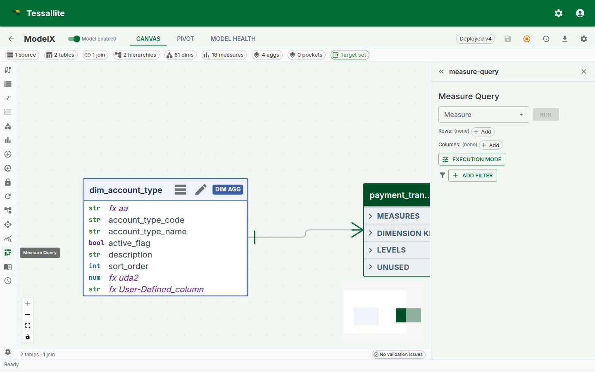
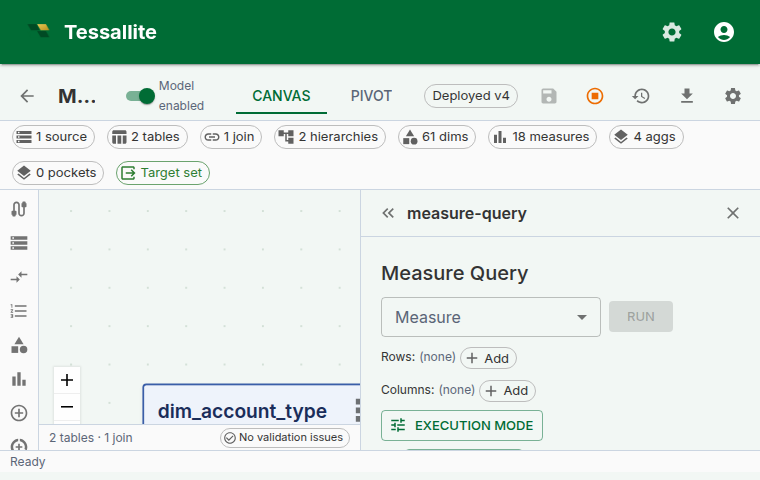

## Why this panel exists

A semantic layer lives or dies by the moment a modeller defines a new measure and checks whether it agrees with the business's mental model. Without a sanity-check surface inside the product, that check happens in Excel, in a notebook, or worse — in a dashboard a week later when the VP asks why the number is wrong.

The **Measure Query Panel** is Tessallite's answer to that moment. It is a minimal, opinionated pivot grid embedded directly inside Model Builder. One or more measures, up to two dimension axes, totals, a Route badge, and click-to-drill. It is not meant to replace a full BI canvas — it is meant to let a modeller answer "does this measure do what I think it does?" without leaving the app.

The panel grew into a small working pivot: **multiple measures in one view**, **the same measure under several aggregate functions** (SUM, AVG, MAX side by side), a built-in **Record Count** column, **multi-row and multi-column dimension nesting**, **subtotals and grand totals with distinct shading**, **header-click sort**, **time-variant measures** (YTD, PY, YoY created via the Measures panel and queryable here like any other measure), **slicers**, **inline format editing**, **Excel/CSV/JSON export**, **saveable and shareable views**, and a **Route badge** that tells you which engine served the query. All of these are scoped so the panel remains a sanity-check tool, not a dashboard-builder.

The setup area is a **single line of selectors** — Add Measure, Add Row, Add Column — with the chosen items listed as plain-text rows underneath. After a successful Run the setup collapses to a one-line summary, leaving the result grid the full height of the panel; an **Edit** control reopens it.

This page walks through what the panel can and cannot do, how the selectors combine, why the Route badge matters, and a worked example from measure definition to drill-down.



*Figure 1 — The full panel. Everything the modeller needs to sanity-check a measure sits in one frame. Full description: [measure-query-panel-overview.txt](../assets/screencaps/measure-query-panel-overview.txt).*

---

## Before you start

- The model must have at least one deployed measure. Calculated measures are welcome — the panel handles drill-through for them specially (see below).
- At least one dimension is typical but not required — a "just the measure" query collapses to a single-cell result, which is a useful sanity check for "does the measure return anything at all?".
- If the measure is time-aware and you want to add variants (YTD, YoY, etc.), the measure must be linked to a time hierarchy with a calendar type configured. A calendar table is not required — period boundaries are computed from SQL expressions. See [Configure Time Variants](configure-time-variants.md).

---

## The three-selector shape

The panel has three primary selectors and two toggles. This shape is intentional: every BI tool in the world overloads the "row / column / filter" choice with nine other decisions, and every business user spends the first five minutes with a new tool trying to work out what they are being asked. Tessallite's panel keeps the choice to the irreducible three.

| Selector | What it does | Can be empty? |
|---|---|---|
| **Add Measure** | Adds a measure column. Add the same measure more than once to compare aggregate functions; add the built-in **Record Count** for a row tally. Standard or calculated, optionally a time variant. | No — a pivot without a measure is a dimension list, not a pivot. |
| **Add Row** | One or more dimensions that appear as rows. Multiple dimensions nest top-down — outermost first. | Yes — the grid collapses to a single row. |
| **Add Column** | One or more dimensions that appear as columns. Multiple dimensions nest left-to-right. | Yes — the grid collapses to a single column. |

Each selection appears as a **plain-text row** beneath the selector line — no chips or coloured badges. A measure row carries its own aggregate-function dropdown, a format button, up/down reorder buttons, and a remove button. A dimension row carries left/right reorder buttons and a remove button.

Plus two toggles:

- **Subtotals / grand totals** — show roll-up rows and columns. Off by default to keep the grid easy to scan for the sanity-check use case; on for anything headed toward a report.
- **Force Live** — bypass aggregate and pocket matchers and run against the source. Covered in [Live vs Aggregate](../querying/live-vs-aggregate.md).

If both row and column selectors are empty, the grid renders one cell per measure with each measure's overall value. This is the fastest way to answer "is this measure even wired up?".

---

## Multi-dimension nesting

Since Phase 6, row and column dimensions both accept multiple selections. Nesting reads **outermost first** on rows and **leftmost first** on columns:

```
Row dimensions:    region, quarter
Column dimensions: product_category

          | Furniture | Electronics | Grocery | (grand)
----------+-----------+-------------+---------+--------
EMEA      |           |             |         |
  Q1      |   120 000 |     80 000  |  60 000 | 260 000
  Q2      |   140 000 |     90 000  |  70 000 | 300 000
  total   |   260 000 |    170 000  | 130 000 | 560 000
NA        |
  Q1      |   220 000 |    160 000  | 110 000 | 490 000
  ...
```

Subtotals appear on the second-and-beyond row levels (one per outer-level value). Grand totals are always the last row and last column. The header depth scales with the number of nested dimensions.

**Why outermost-first and not some other order.** Reading top-down matches the way finance tables are taught at school and read by stakeholders. The alternative (innermost-first) is mathematically identical but reads "by quarter, within region" where stakeholders expect "by region, then by quarter". Tessallite picks the convention that matches the reader, not the query planner.

---

## Multiple measures and aggregate functions

A view can show more than one measure column. Each click of **Add Measure** appends a new column; the columns appear left to right in the order you add them, and the up/down reorder buttons on each measure row change that order.

The same measure can appear more than once, each instance with its own aggregate function. Add `Revenue` three times and set the per-row dropdowns to **SUM**, **AVG** and **MAX**, and the grid shows three Revenue columns side by side — the total, the average and the largest — all from one Run. Each column header reads `Revenue (Sum)`, `Revenue (Average)`, `Revenue (Max)` so the function is never ambiguous.

**Totals are aggregate-aware.** The panel computes additive **SUM** and **COUNT** totals from the displayed detail values. For **AVG**, **MIN**, **MAX**, **COUNT DISTINCT**, and other non-composable measures, it requests the required supplementary grouping grains so the displayed total is calculated at the correct grain. If a supplementary result is unavailable, the cell fails closed with an em-dash (—) instead of showing a misleading number.

## Record Count

The **Record Count** entry in the Add Measure list adds a `COUNT(*)` column — the number of source rows behind each cell. It behaves like any other measure column: it can be reordered, removed, and it participates in subtotals and grand totals (counts are additive). Record Count is a fast way to confirm a cell is backed by the row volume you expect — a region showing a large revenue but a record count of 1 is usually a data problem, not a sales record. Record Count cells are not drillable (there is no single measure to decompose).

---

## The Route badge

Every executed query shows a Route badge above the grid. The badge text is one of `aggregate`, `pocket`, or `live`. Hover the badge and a tooltip shows the routing reason — which aggregate / pocket matched, or why no match was found.

The Route badge is the single most useful piece of information on the panel when something looks wrong. A cell value that surprises you almost always has one of three origins:

1. **The measure is wrong.** Rare once the measure is saved cleanly — the DSL validator catches most of this.
2. **The aggregate is stale.** Common. The badge reads `aggregate`, the number is the one from when the aggregate last built, and the source has moved since.
3. **The slicer is filtering more than you remember.** Common. The badge does not tell you this directly, but the row / column totals do — if the grand total looks too small, check the slicer chips.

See [Live vs Aggregate](../querying/live-vs-aggregate.md) for a full walkthrough of the three routes and when to Force Live.

---

## Time-variant measures in the pivot

Time-variant measures — YTD, prior year, trailing average, year-over-year growth, and more — are created in the **Measures panel**, not in the pivot itself. Once created, they appear in the pivot's **Add Measure** dropdown exactly like any other measure, with a small label next to their name indicating the variant kind (e.g. "(ytd)"). You select them, run the query, and they render as ordinary measure columns in the grid.

### Creating a variant

Open the Toolbelt, go to **Measures**, open the base measure you want to derive from, tick the variant(s) you want under **Time variants**, and save. The Measures panel shows each variant kind's eligibility status inline: ineligible kinds are disabled and display the specific reason (for example, "This measure has no associated time hierarchy"), and variants that already exist are disabled with an "already added" label. For parametric variants (`trailing_n` and `moving_avg_n`), a number field lets you set the window size N.

See [Configure Time Variants](configure-time-variants.md) for the full setup walkthrough, prerequisite chain, and troubleshooting table.

### What happens under the hood

Each variant you create becomes a first-class measure row in the catalog, named `<base>_<variant>` (for example `revenue_ytd`). The variant row inherits the base measure's source column, aggregation, format, and data type. At query time, the query router rewrites the variant into a window function using SQL expressions derived from the hierarchy's calendar type. If a calendar table is present, the system uses it for backward compatibility. No data is duplicated in storage.

**A modelling note.** Variants only make sense on additive measures. A "Gross margin % YoY" is a ratio of ratios and almost always misleading — Tessallite will let you compute it, but the variant tooltip shows the raw formula so the analyst can see what they are asking for.

---

## Slicer chips

Slicer chips sit below the Route badge and function as global `WHERE` predicates on the whole grid. Each chip is one predicate — `region in (EMEA, APAC)`, `year = 2024`, `channel != marketplace` — and every chip is AND'd. A click on a chip's body opens an edit popover; a click on the X removes the chip.

The design intent is that slicers carry **global context** and the row / column dropdowns carry **what you are slicing by**. Mixing the two is the most common first-week mistake for a business user — they put a single-value dimension on rows, see one row, and wonder why. The slicer bar is always at the bottom so "what's constraining my result" is one glance away.

### Filter types

The slicer supports multiple filter modes depending on the dimension type and selected operator:

| Filter mode | Operators | UI control | Best for |
|---|---|---|---|
| Multi-value | `in` | Autocomplete with type-ahead search | Categorical dimensions (region, product) |
| Single-value comparison | `eq`, `ne`, `gt`, `gte`, `lt`, `lte` | Text field | Numeric or string comparisons |
| Date range | `between`, `eq`, `gt`, `gte`, `lt`, `lte` | Native date picker | Date/timestamp dimensions |
| Null check | `is null`, `is not null` | (no value input) | Finding missing data |

**Date-aware slicers.** When you add a slicer on a date dimension (`is_time_dim = true`), the operator defaults to `between` and the value inputs are date pickers. This is faster than scrolling through thousands of date value chips.

**Type-ahead search.** Multi-value slicers on text dimensions include a search field. Type at least 2 characters and the autocomplete filters the value list after a 300ms debounce. This makes slicing on high-cardinality dimensions (e.g. product SKU, customer name) practical.

**Numeric range filters.** For numeric dimensions, operators like `gt`, `gte`, `lt`, `lte` let you define range filters (e.g. "order_amount > 1000"). Combine two slicers for a range: `order_amount >= 100` AND `order_amount <= 500`.

---

## Inline format editing

Every measure carries a format. The format is what turns `1234567.891` into `€1,234,567.89` or `1.23M`. Since Phase 6, the column-header chip on the grid carries the current format and opens an editor popover on click.



*Figure 3 — The inline format editor. Changes can be scoped to this column only, or promoted onto the measure itself for everyone. Full description: [measure-query-panel-format-editor.txt](../assets/screencaps/measure-query-panel-format-editor.txt).*

Two scopes sit at the bottom of the editor:

- **Apply to this column only.** A temporary override that lives in the panel state. Closing and reopening the panel resets it.
- **Save on measure.** Promotes the format onto the measure definition. Every surface — BI tool, MCP agent, other modeller — sees the new format on the next query.

The presets cover 95% of business-display needs; the tail (custom suffix strings, dynamic currency from a column) is not in v1 and is deferred to a future phase.

---

## Header-click sort

Every value-column header carries a sort glyph. When the column is unsorted the glyph is a faint neutral up/down marker; click it once to sort ascending (arrow up), again for descending (arrow down), and a third time to clear. The glyph is always visible, so you can see at a glance which columns are sortable and which way the active sort runs. The grand-total column header is sortable too.

Sort is client-side — the data in the grid is already present, and re-sorting does not re-run the query. This matters because a sort of a 720-row grid is instant, but a sort that re-queries would not be on most warehouses. There is no separate sort toolbar; the headers carry the full control.

Sorting is stable across pagination within the grid view (for large result sets). The Route badge and slicers are unaffected by sort.

Saving the view also saves the active sort. Reloading identifies the target by measure, aggregation, repeated-measure occurrence, and exact column tuple (or the grand-total column), so the same sort direction is restored even when a measure appears more than once. If that measure or column no longer exists, or the saved-sort version is unsupported, the panel shows a warning and clears the stale sort before the view can be saved again.

## Total and subtotal shading

Subtotal rows and columns use a light brand-green tint; grand totals use a deeper tint of the same green. The two shades are distinct from each other and from the header, so when several total levels stack you can tell a region subtotal from the grand total without reading the labels.

---

## Export

The **Export** split-button offers Excel (XLSX), CSV, and JSON. The CSV and Excel exports contain the same grid that is on screen: **every measure column** (not just the first), the **subtotals and grand totals** when those are switched on, the user's **current sort order**, and the active slicers. JSON exports the raw result set as returned by the query router. Excel preserves the per-measure number formats and the total shading; CSV is plain text for spreadsheet or pipeline use.

---

## Saving and sharing a view

A pivot layout — its measures, dimensions, slicers, totals, and exact sort target and direction — can be saved as a **view** and reloaded later, so you do not have to rebuild a familiar cut every time.

A saved view is **personal by default**: only you see it. To let everyone working on the model use it, open the view and choose **Share**. A shared view becomes visible to everyone with access to the model, but **only you, the owner, can edit or delete it** — a "Shared" badge and a "Shared by …" label make ownership clear so a teammate knows whose view it is. Choose **Make private** to pull it back to just yourself again.

Use sharing for layouts the whole team relies on — a standard revenue cut, a month-end pivot — and keep experimental layouts private until they are worth promoting.

---

## Drilling down a hierarchy in the grid

When a row dimension is the top of a defined hierarchy (for example `Year` in a Year → Month → Day date hierarchy), the panel lets you walk down that hierarchy without leaving the grid. Drillable row labels show a small ▸ marker, and hovering the label displays a hint naming the hierarchy the drill goes through — for example **"Drill down through application_date_hierarchy"**. This tells you, before you click, that a deeper level exists and which hierarchy it belongs to.

Clicking a drillable row label swaps that row for its child level (Year becomes Month), pins the clicked value as a slicer, and **re-runs the query automatically** so the grid shows the child rows with their real values. A breadcrumb appears above the grid (`All / Year: 2024 / ...`); click any earlier crumb to climb back up. Each step re-runs immediately, so the row labels always reflect the level you are actually viewing.

---

## Drill-through on calculated measures

Calculated measures were previously not drillable from the panel. Since Phase 6, clicking a calculated-measure cell opens a **decomposed drill drawer** that fires one drill-through per referenced base measure and stacks the mini-panels — each paginating independently at 50 rows per page. See the [Drill-through](drill-through.md) page for the full description. Ordinary cells and all six subtotal/grand-total cell shapes are clickable for standard and calculated measures. Total drills send only the row and column levels retained by that total, while preserving active slicers and the selected measure's exact aggregation. The two exceptions are **Record Count** and scratchpad-expression columns, which have no single underlying measure to decompose and so are not clickable.

---

## Worked example — sanity-check a new calculated measure

**Context.** A modeller just defined `gross_margin_pct` as a calculated measure. They want to confirm it reads sensibly before inviting finance to the model.

**Steps.**

1. Open **Model Builder** → **Measure Query** in the Toolbelt.
2. Pick `Gross margin %` as the measure. Leave row and column dimensions empty.
3. Click **Run**. Expected result: a single cell with an overall percentage value. If it is `NULL`, the denominator is zero at the global grain — usually a sign that the base measure `net_sales` has no data, not that the calculated expression is broken.
4. Add `region` as a row dimension. Click **Run**. Expected result: one percent per region, values in the 20-40% band for a typical retail model. If one region reads 300%, the calculated expression is probably in the wrong mode — switch to `expression_as_written` (see [Calculated Measures](calculated-measures.md)).
5. Add `quarter` as a column dimension. Click **Run**. The grid now reads regions × quarters.
6. Enable subtotals. Confirm subtotals make financial sense — each region's "total" column should read as the overall margin for that region, not a sum of percentages.
7. Click any cell to open the decomposed drill drawer. Confirm the numerator and denominator rows match what you expect.
8. If the number is surprising, click the Route badge. If it reads `aggregate`, turn **Force Live** on, re-run, and compare. A matching number confirms the aggregate is fresh; a different number says refresh the aggregate.

The whole loop takes under two minutes. The measure is then safe to expose to a BI tool.

---

## Scope and limitations

| Feature | v1 | Future |
|---|---|---|
| Multiple measures per view | Yes | Add several measures; reorder and remove each independently. |
| Same measure under multiple aggregate functions | Yes | Add a measure more than once, each with its own function (SUM, AVG, MAX…). |
| Built-in Record Count column | Yes | `COUNT(*)` per cell; additive in totals. |
| Multi-row / multi-column dimensions | Yes (Phase 6) | Cross-tab layout supported. |
| In-grid row hierarchy drill-down | Yes | Walk a hierarchy on rows (Year → Month → Day) with a hover hint and breadcrumb; the query re-runs on each step. |
| Global slicers | Yes (Phase 6) | Saved slicer presets deferred. |
| Subtotals + grand totals | Yes (Phase 6) | Alternate total functions (averages, medians of subtotals) deferred. |
| Variants (YTD, YoY, etc.) | Yes (Phase 6, built on Phase 2 time intelligence) | Custom user-defined variant formulas deferred — use a calculated measure in the interim. |
| Excel (XLSX) + CSV + JSON export | Yes | All three formats export every measure, the totals, and the current sort. |
| Saved views | Yes | Save a pivot layout, including its stable sort target and direction, and reload it later, or copy a shareable link. |

---

## Troubleshooting

| Symptom | Likely cause | Fix |
|---|---|---|
| "Run" button greyed out | No measure selected | Pick a measure; dimensions alone are not a query |
| Grid empty after Run | Slicer chips exclude every row | Check the chip row below the Route badge; remove the offending chip |
| Cell values look right but totals look wrong | Subtotals off while dimension nesting on | Enable the subtotals toggle |
| All variant kinds disabled in the Measures panel | Missing prerequisite: no time hierarchy on the measure's table, or no calendar type on the hierarchy | Check the reason text next to each disabled kind. See [Configure Time Variants](configure-time-variants.md) for the full prerequisite chain. |
| Period-boundary variants disabled in the Measures panel | The associated time hierarchy has no calendar type configured | Edit the hierarchy in the Hierarchies panel and set a calendar type (standard, fiscal, hijri, or iso). See [Configure Time Variants](configure-time-variants.md). |
| Cell click on calculated measure errors | Very old frontend cache | Hard-refresh; Phase 6 shipped the decomposed drawer |
| Row labels read "(null)" after drilling into a hierarchy | Old frontend cache (pre-fix the grid did not re-run after an in-grid drill) | Hard-refresh; the grid now re-runs the query automatically on each drill step |

---

## Related

- [Calculated Measures](calculated-measures.md)
- [Drill-through](drill-through.md)
- [Live vs Aggregate](../querying/live-vs-aggregate.md)
- [Configure Time Variants](configure-time-variants.md)
- [Configure Calendar Table](configure-calendar-table.md)

---

← [Multi-Calendar Best Practices](multi-calendar-best-practices.md) | [Home](../index.md) | [Pivot Conditional Formatting →](pivot-conditional-formatting.md)
