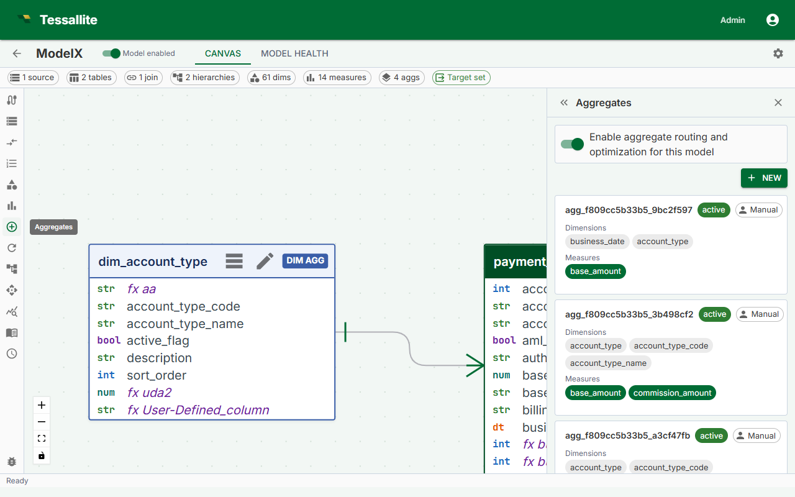

## What this covers

A refresh re-executes the aggregate query against the source data and overwrites the summary table in the query target. Refreshes run automatically on the cron schedule you configure, but you can also trigger one manually at any time. This article explains what happens during a refresh, when to trigger one manually, the three ways to do it, and what the aggregate status indicators mean.

---

## What a refresh does

During a refresh, the Scheduler service:

1. Connects to the source and runs the aggregate's GROUP BY query.
2. Drops the existing summary table in the query target.
3. Writes the new result set as the replacement summary table.

The drop-and-replace approach means the summary table is briefly unavailable during the write. Queries arriving during this window are routed directly to the source fact table and are answered correctly, just without the performance benefit of the aggregate.

---

## When to trigger a manual refresh

- Source data was loaded outside the normal schedule and the summary is stale.
- You changed the aggregate grain or measures and want the summary to reflect the new definition immediately rather than waiting for the next scheduled run.
- A previous refresh failed and you have resolved the underlying cause (for example, a permissions error on the query target).
- You are testing a newly created aggregate before relying on it in a dashboard.

---

## Aggregate status

| Status | Meaning | What to do |
|---|---|---|
| **Ready** | The summary table is current. The last refresh completed successfully. | Nothing. The aggregate is serving queries. |
| **Stale** | The summary table exists but is older than the configured schedule interval, or source data has changed since the last build. | The aggregate still serves queries with older data. Trigger a manual refresh if freshness matters, or wait for the next scheduled run. |
| **Building** | The aggregate was just created and the initial build has not yet completed. | Wait. The Scheduler picks up new aggregates within one minute. Check the Health tab if Building persists beyond five minutes. |
| **Refreshing** | A refresh is in progress right now. | Wait for it to complete. Queries during this window fall back to the source fact table. |
| **Error** | The last refresh attempt failed. The previous summary table (if any) is still in place and still served to matching queries. | Open the Health tab to read the error detail. Fix the cause and run a manual refresh to confirm it is resolved. |

---

## Option 1 — Refresh a single aggregate from the Canvas

1. In Model Builder, click the aggregate node in the Canvas. The aggregate is highlighted and the Drawer opens on the right.
2. In the Drawer, click **Refresh Now**.
3. The aggregate status changes to **Refreshing**. When the refresh completes, the status returns to **Ready**.

---

## Option 2 — Refresh all aggregates from the Summary Bar

1. At the bottom of Model Builder, locate the **Summary Bar**.
2. Click **Refresh All**.
3. Tessallite queues all aggregates in the model for refresh. Refreshes run sequentially, one aggregate at a time, to avoid placing concurrent load on the source.

> **Note:** **Refresh All** runs aggregates sequentially, not in parallel. On a model with many aggregates, the full cycle may take several minutes. Monitor progress in the Canvas — each aggregate's status badge updates in real time.

---

## Option 3 — Trigger a refresh from the Aggregates page

1. Open the **Aggregates** page and switch to the **Refresh** tab.
2. Locate the aggregate in the list.
3. Click **Run Now** next to the aggregate entry.
4. The Scheduler executes the refresh immediately, outside of the regular cron schedule. The next scheduled run is not affected.

---

## Refresh failures

If a refresh fails, the aggregate status changes to **Error**. The Scheduler records the error message and timestamp. Open the Health tab in Model Builder to view the full error detail, including the SQL query that failed and the error returned by the source. Fix the root cause — most commonly a network issue, a missing permission on the query target, or a schema change in the source — and then run a manual refresh to confirm the fix before the next scheduled run.

---

## Related

- [Configure Aggregates](configure-aggregates.md)
- [View Model Lineage](view-model-lineage.md)
- [Manage Aggregate Schedules](manage-aggregate-schedules.md)
- [Aggregates (concept)](../concepts/aggregates.md)

---

← [Configure Pocket Tables](configure-pocket-tables.md) | [Home](../index.md) | [Manage Aggregate Schedules →](manage-aggregate-schedules.md)
