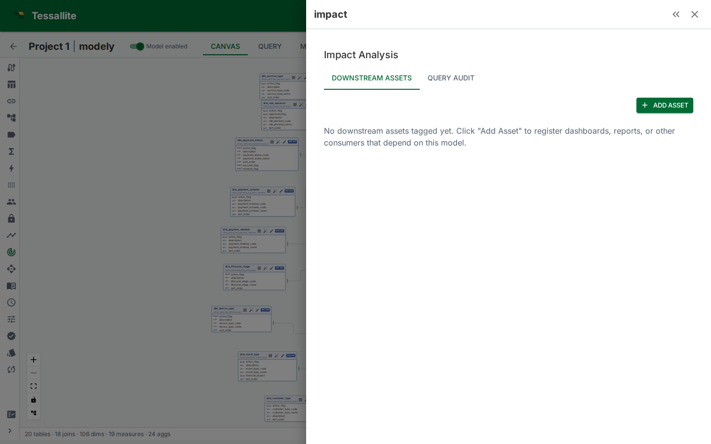

## What this covers

This panel helps you keep a record of who and what depends on a model. It has three tabs: manually recorded **downstream assets**, table-level **query usage**, and producer-derived **column usage**. Together they show known consumers and the successful queries observed through Tessallite before you change a model.

> **Beta.** This feature is implemented and unit-tested but has not completed its acceptance run. Treat the results as informational rather than a complete inventory.

---

## What this feature does -- and does not -- do

It is important to be precise about the scope, because the three tabs have real limits:

- **Manual downstream assets are exactly what you enter.** Nothing is discovered automatically. If a dashboard is not tagged, the panel does not know about it.
- **The usage scan reads Tessallite's own query log, not the source database.** It looks at queries that flowed *through the Tessallite gateway* and were logged there. It does **not** read the source database's own query history (for example PostgreSQL `pg_stat_statements` or BigQuery `INFORMATION_SCHEMA.JOBS`). Queries that reach the source by some other path are invisible to it.
- **Column Usage uses semantic references recorded by the query router.** New log rows carry stable model-column IDs for selected, filtered, grouped, and measure-backed fields. Older rows without those references use semantic and rewritten-SQL names as a fallback, and ambiguous matches are labelled.
- **Calculated and UDA-backed fields ARE traced back to the columns they read.** If a measure is worked out from other measures, or a field is built from an attribute, Tessallite follows the chain and marks the underlying columns as used. So a column you only ever use inside a calculation still shows up as in use, and you will not drop it by mistake.

In short: this is a usage-and-consumption record, not a full lineage or breaking-change analyser. Use it to build awareness of consumers, not as a guarantee that you have found every dependency.

---

## Three parts of the panel

### Downstream assets (manual)

You register downstream assets by hand. This is the authoritative list and gives you full control over what is tracked.

1. Open the **Usage & Downstream Assets** panel in Model Builder (Toolbelt sidebar).
2. Click **Add Asset**.
3. Enter the asset details:
   - **Name** (e.g. "Sales Dashboard", "Weekly Revenue Report")
   - **Type** (Dashboard, Report, ML Job, API, Other)
   - **Owner** (person or team responsible)
   - **URL** (optional link to the asset)
   - **Notes** (optional free text)
4. Click **Save**. The asset appears in the downstream assets list.

Because the list is manual, its value depends on keeping it current. When a dashboard is retired or a new report is built, update the list so it stays a reliable record.

### Usage scan (query log)

Tessallite scans its **own internal gateway query log** to discover which of the model's physical tables have been queried through the platform. The scan searches the recorded query text of successful gateway queries for the model's physical table names, matched as whole identifier tokens (so `order` does not match `orders`).

To run a scan:

1. Open the **Usage & Downstream Assets** panel.
2. Switch to the **Query Usage** tab.
3. Click **Run scan**. Tessallite reviews the gateway query log for this model and looks for the model's table names in the recorded queries.
4. Review the results. Each row shows the matched table, the user who ran the query, how many times the pattern was seen (hit count), and when it was last observed.

The scan is incremental: it only reads log rows newer than the last scan, so pressing the button again on an unchanged log adds nothing. It is a supplement to the manual list -- it can surface table-level usage you had not tagged, within the limits described above.

### Column usage (query log)

Open the **Column Usage** tab to see stable column references recorded during semantic binding. Each row identifies the model table and column, the number of references, the number of distinct queries, and the latest observed use. This view reads the query log directly; **Run scan** is only needed to refresh the persisted table-usage summary.

For legacy rows without stable references, Tessallite reconciles semantic and rewritten SQL names against model columns. A warning marks results where a name maps to more than one model column.

---

## Reading the panel

### Summary line

When at least one downstream asset is registered, a summary line shows how many assets depend on the model, broken down by type.

### Downstream assets list

Each asset shows its name (linked if you supplied a URL), type, owner, and the number of columns you associated with it. Click the edit icon to change an asset, or the delete icon to remove it.

### Query Usage tab

Shows, for this model:
- The model's physical tables that appeared in logged gateway queries
- Hit count (how many distinct logged query patterns referenced each table)
- The user who ran the query and when it was last seen

### Column Usage tab

Shows which column each reference belongs to, how many times it was referenced, how many separate queries touched it, and when it was last used. Columns reached indirectly - through a calculated measure, a time-comparison variant, or an attribute-backed field - are included, so the list covers what queries really read, not only what they spell out.

---

## When to use it

- **Before retiring or heavily changing a model.** Check the downstream assets list to see who to notify, and run a usage scan to see which tables were actually queried recently.
- **During model reviews.** A model with many recorded consumers and active query usage deserves more care than one with none.
- **To keep a shared consumer record.** The manual list is a lightweight place for the team to record known dashboards, reports, and jobs in one spot.

---

## Best practices

- **Keep the manual list current.** Its usefulness comes entirely from being up to date. When a dashboard is retired or a report changes, update the entry.
- **Run usage scans periodically.** New consumers may appear in the query log that were never tagged by hand. The scan picks up where it left off and reads a batch at a time: if the panel says more entries remain, press **Run scan** again to keep going. If it says nothing new was recorded, that simply means no one has queried the model since the last scan - it does not mean the model is unused.
- **Do not treat usage as complete.** It only sees queries logged by the Tessallite gateway. Consumers that reach the source another way, or that you never tagged, will not appear. Column Usage also reads only the most recent batch of query log entries and tells you when older ones exist beyond it, so an empty result means "nothing found in what was read", not "nothing uses this". A `SELECT *` query names no individual column, so it counts as table usage but adds nothing to Column Usage.
- **Combine all three tabs.** The manual list captures known consumers with owners; the usage views show observed table and direct column references. Read them together.

---

## Related

- [View Model Lineage](view-model-lineage.md)
- [Save and Version a Model](save-and-version-a-model.md)
- [Deploy a Model](deploy-a-model.md)

---

← [Data Quality Rules](data-quality-rules.md) | [Home](../index.md) | [Named Queries →](named-queries.md)
