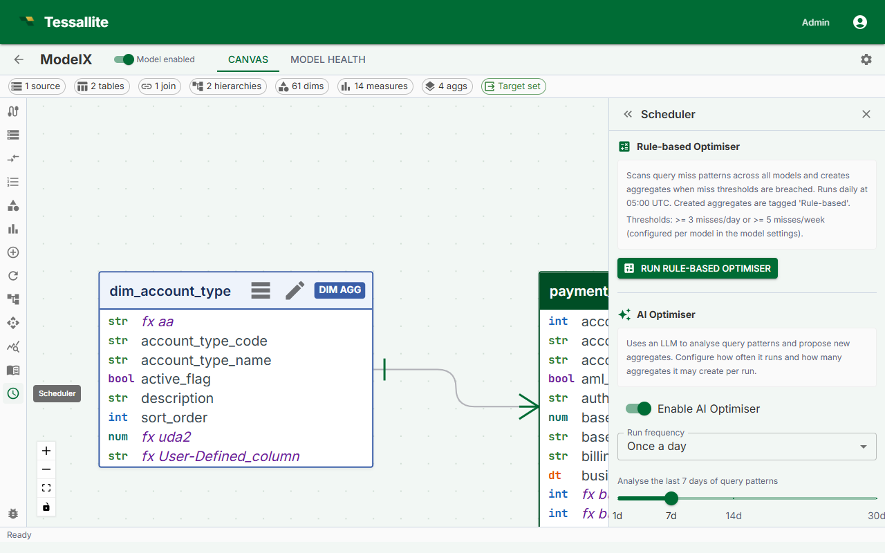

## What this covers

The AI Optimiser analyzes query miss patterns against your model, scores potential aggregate configurations by estimated return on investment, and surfaces ranked recommendations. This article explains how to open the Optimiser, how to read the recommendation list, and how to act on each recommendation.

---

## How the Optimiser works

Every time a query reaches the Query Router and no suitable aggregate exists to answer it, the miss is recorded in the query miss log. The Optimiser reads this log, groups misses by grain (the combination of dimensions and measures requested), and scores each group by the estimated query time that could be saved if an aggregate existed for that grain. The result is a ranked list of candidates ordered from highest to lowest ROI.

The Optimiser requires data in the query miss log before it can make recommendations. At least some queries must have run against the model after it was published. If no queries have run yet, the recommendation list will be empty.

---

## Opening the AI Optimiser

1. Open your project in Model Builder.
2. In the Toolbelt on the right side of the screen, click **Optimiser**.
3. The AI Optimiser panel opens and displays the current recommendation list.

---

## Reading the recommendation list

| Column | Description |
|--------|-------------|
| Grain / Dimensions | The set of dimension columns defining this aggregate's level of detail. |
| Measures | The numeric columns the Optimiser recommends pre-aggregating for this grain. |
| Query hits | The number of times this pattern was missed. Higher values = more frequent. |
| ROI score | Combines query frequency and estimated time saved per query. |
| Action | Build, Schedule, or Dismiss. |

---

## Actions

**Build** — Queues the aggregate for immediate construction. The aggregate appears in Canvas as Building, then transitions to Ready when complete.

**Schedule** — Adds the aggregate to the regular build cycle without an immediate build. The workspace default refresh schedule is applied. Adjust it in the aggregate Drawer or the Aggregates page, Refresh tab.

**Dismiss** — Removes the recommendation without creating an aggregate. If the same miss pattern recurs, the recommendation may reappear.

---

## Re-scoring after acting on a recommendation

After you Build, Schedule, or Dismiss, the Optimiser re-scores remaining candidates and updates the list. Aggregates already built or scheduled are excluded from future recommendations.

---

## Optimiser vs. manual configuration

Use the Optimiser when you do not know which queries are slow or which aggregates would have the most impact.

Use manual aggregate configuration when you know the exact grain you need and want direct control over the definition, refresh schedule, and partitioning.

Both approaches can be combined. The Optimiser handles opportunistic coverage; manual configuration handles known, critical queries.

---

## Running the AI advisor (Smart Builder)

The AI advisor studies how the model is actually queried and uses an LLM to propose aggregates, scoring each suggestion. Two settings shape how it behaves, and one rule governs when you can run it.

### Save before you run

The advisor reads the model exactly as it is **saved on the server**, not the draft you are editing. If you have unsaved changes in the Builder, the **Run AI now** button stays disabled until you Save. This is deliberate: it stops the advisor from analysing a shape that no longer matches what you see, and saves you from a confusing "version conflict" afterwards. Save first, then run.

### Minimum confidence

Each recommendation carries a **confidence** score between 0 and 1. The **minimum confidence** setting (default 0.5) filters out anything the advisor is unsure about — low-confidence suggestions are still written to the run's decision log for transparency, but they are not offered as actions. Raise the threshold to see only the advisor's strongest calls; lower it to see more, including speculative, suggestions. Start near the default and adjust once you see how the advisor behaves on your model.

### Require review before applying

By default, an approved AI suggestion is built and routed straight away. If you would rather check every change first, turn on **Require review before applying**. With it on, the advisor still studies the data and still proposes aggregates — but instead of building them it registers each one as a **disabled** aggregate. Nothing is built and no query is sped up until you open the aggregate and enable it yourself. This is the safe choice while you are learning how the advisor behaves on a model; turn it off once you trust the suggestions and want them applied automatically.

### Only one run at a time

An AI run holds a per-model lock while it works, and it runs in the background — you get an immediate acknowledgement and a visible "running" row rather than a frozen screen. If a run is already in progress — whether you started it or a schedule did — starting another is rejected with an "AI run in progress" message instead of running two at once. Wait for the current run to finish, then try again.

---

## Related

- [View Diagnostics](view-diagnostics.md)
- [Manage Aggregate Schedules](manage-aggregate-schedules.md)
- [Configure Aggregates](configure-aggregates.md)
- [Aggregates (concepts)](../concepts/aggregates.md)

---

← [Scheduler Dependencies](scheduler-dependencies.md) | [Home](../index.md) | [Usage Analytics →](usage-analytics.md)
