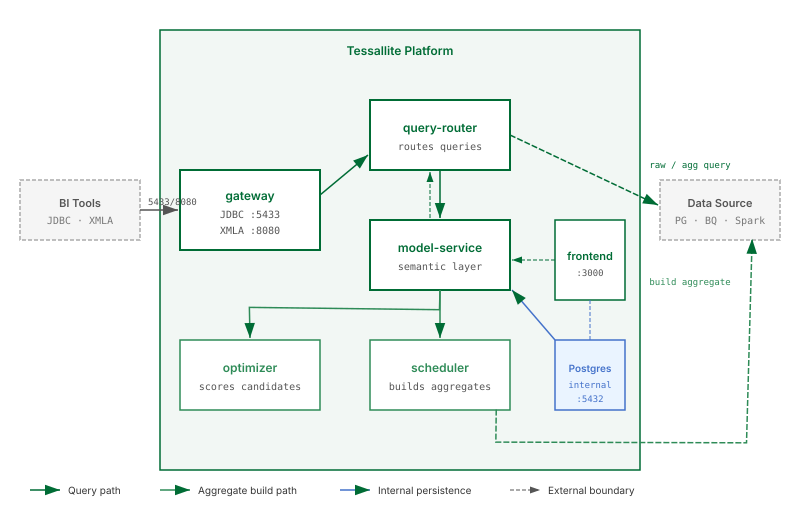

## What this covers

The seven services that make up the Tessallite platform, the internal database, the optional monitoring stack, how data flows through the system, multi-tenant isolation, and where aggregates and pocket tables are physically stored.

---

## Clients

Five types of client connect to the platform:

| Client | Protocol | Connects to |
|---|---|---|
| **BI tools** (DBeaver, Tableau, Superset, psycopg2) | JDBC (port 5433) | gateway |
| **Excel via XMLA** (PivotTables, Power BI) | XMLA/HTTP (port 8080) | gateway |
| **Excel Add-in** (Office.js task pane) | HTTPS (port 3443) | frontend (nginx proxy to model-service, query-router, agent-service) |
| **Conversational Client** (standalone chat app) | HTTP | model-service (auth), agent-service (chat) — directly or via frontend proxy |
| **Tessallite Frontend** (browser SPA) | HTTP/HTTPS (port 3000/3443) | frontend (nginx proxy to all backend services) |

The **Excel Add-in** is a React-based Office.js task pane (`excel-plugin/`) that embeds inside Excel. It provides a Report Builder, Ask Tessallite chat panel, CUBE formula wizard, drill-through, persona switching, and query trace. It connects to Tessallite through the frontend's HTTPS endpoint.

The **Conversational Client** is a standalone chat-first web application (`conversational-client/`) with a Flask SSE proxy backend and a React/MUI frontend. It connects directly to model-service for authentication and agent-service for conversations, or through the frontend proxy.

---

## Service map

```
Clients
  |-- BI tools (DBeaver, Tableau, Superset) ---> gateway :5433 JDBC
  |-- Excel PivotTables / Power BI -----------> gateway :8080 XMLA
  |-- Excel Add-in --------------------------> frontend :3443 HTTPS
  |-- Conversational Client ------------------> model-service / agent-service
  +-- Tessallite Frontend (browser) ----------> frontend :3000 HTTP
                                                    |
                      nginx reverse proxy to all backend services
                                                    |
              +-------------+-------------+-------------+-------------+
              |             |             |             |             |
        model-service query-router   optimizer    scheduler   agent-service
           :8001        :8000         :8000        :8000        :8000
              |             |             |             |             |
              +-------------+-------------+-------------+-------------+
                                          |
                                    [ PostgreSQL :5432 ]
                                          |
                              tessallite_system (platform)
                              <tenant>_meta (models)
                              <tenant>_aggregates (materialised tables)

Optional (standalone Docker Compose project in monitoring/):
  [ prometheus :9090 ]       Metrics collection (scrapes all 7 services)
  [ grafana    :3001 ]       Dashboard UI (21 panels, 3 sections)
  [ nginx-exporter   ]       Translates nginx stub_status for frontend
```

---

## Services

### gateway

The public entry point for query traffic from BI tools. Exposes two protocol endpoints:

- **JDBC** (port 5433) — a PostgreSQL wire protocol listener. Any JDBC-compatible tool (DBeaver, Tableau, Superset, psycopg2) connects here.
- **XMLA** (port 8080) — an HTTP/SOAP endpoint for Excel and Power BI. Handles DISCOVER (catalogue browsing) and EXECUTE (DAX/MDX queries).

Gateway authenticates callers via Basic auth (exchanged for a JWT through model-service) or Bearer JWT, translates incoming queries, and forwards them to query-router. It holds no state between requests. Personas are resolved from the JDBC `dbname` or XMLA `Catalog` property — each persona produces a sibling catalogue (`model_persona`) alongside the base model.

### model-service

The semantic layer and platform API. This is the central API server that external clients (conversational client, Excel add-in, embed consumers, MCP server) connect to for authentication, model metadata, and management operations. Stores and serves all model metadata: projects, connections, tables, joins, dimensions, measures, hierarchies, aggregates, pocket tables, personas, row-security rules, data-quality rules, alerts, and audit logs. Provides authentication (JWT via httpOnly cookies or Bearer headers), RBAC enforcement, user management, import/export, and the embed token API. All data is persisted in the internal PostgreSQL database.

In local Docker deployment, model-service is exposed internally and reached through the frontend's nginx proxy. In GCP Cloud Run deployment, it runs as a standalone public service.

- **Port:** 8001

### query-router

Receives queries from gateway, the frontend's Query panel, the Excel add-in, and the conversational agent. For each query:

1. Parses SQL or DAX into a logical IR.
2. Binds the IR to the semantic model (dimensions, measures, hierarchies).
3. Applies persona gates and row-security filters.
4. Checks for matching aggregates or pocket tables.
5. If a match exists, rewrites the query to target that pre-built table.
6. If no match, routes to the raw source tables and records a miss.
7. Executes the query and returns results with a route trace.

Supports three route types: `aggregate`, `pocket`, and `source`. Every response includes `route_type` and a human-readable `reason` so the caller knows which path served the query.

- **Port:** 8000 (internal HTTP)

### optimizer

Reads the query miss log and scores candidate aggregates by return on investment. When a candidate exceeds the score threshold, it appears as a build recommendation in the frontend. The AI-assisted mode uses an LLM to analyze miss patterns and suggest optimal grain/measure combinations.

- **Port:** 8000 (internal HTTP)

### scheduler

Builds and refreshes aggregate and pocket tables in the user's target schema. Supports two refresh modes:

- **Full refresh** — DROP + CTAS rebuild of the entire aggregate table.
- **Incremental refresh** — watermark-based partial update using DELETE + INSERT for the changed window.

Runs on configurable cron schedules (per-aggregate policies) and can be triggered on demand via API or the frontend. Also performs hourly schema drift detection and daily aggregate retirement sweeps.

- **Port:** 8000 (internal HTTP)

### agent-service

The conversational AI backend. Accepts natural-language questions, translates them into semantic queries via the query-router pipeline, and returns answers with citations and optional chart visualisations. Supports multiple LLM providers (Claude, GPT, Gemini) with configurable routing. Features include session memory, judge rubrics for answer quality evaluation, cross-model calculation recipes, and a glossary alias map for natural-language entity resolution.

- **Port:** 8000 (internal HTTP)

### frontend

The web management interface. An nginx reverse proxy serving a React 18 + MUI SPA on port 3000 (HTTP) and port 3443 (HTTPS). The SPA includes:

- **Workspace Explorer** — project and model browser.
- **Model Builder** — visual canvas for tables, joins, dimensions, measures, hierarchies, aggregates, pockets, personas, row security, data quality, and lineage.
- **Query panel and Measure Query panel** — in-app pivot surface with drill-through, format tokens, and force-live toggle.
- **Agent chat** — conversational interface backed by agent-service.
- **Admin panels** — user management, roles, audit logs, query logs, webhooks, SSO, alert configuration, and system settings.

Nginx proxies all `/api/` requests to model-service, `/query-router/` to query-router, `/optimizer/` to optimizer, `/scheduler/` to scheduler, `/agent/` to agent-service, and `/gateway/` to gateway — so the browser never makes cross-origin requests.

- **Ports:** 3000 (HTTP), 3443 (HTTPS)

---

## Internal PostgreSQL database

Tessallite runs its own PostgreSQL 15 instance (port 5432, internal only) to store all operational state. The database uses a multi-schema architecture:

| Schema | Purpose |
|---|---|
| `tessallite_system` | Platform-level metadata: system tenants, revoked embed tokens |
| `<tenant>_meta` | Per-tenant model metadata: projects, connections, models, dimensions, measures, aggregates, query logs, alerts, audit trail |
| `<tenant>_aggregates` | Per-tenant materialised aggregate and pocket tables (when the target is the internal DB) |

> The internal PostgreSQL database is not exposed outside the container network. No BI tool or user application should connect to it directly.

---

## Multi-tenant isolation

Each tenant gets its own PostgreSQL schemas (`<slug>_meta` for model metadata and `<slug>_aggregates` for materialised tables). Connection credentials are Fernet-encrypted in `project_connections`. Tenant resolution happens via JWT claims or JDBC `dbname` parameter. Tenants cannot access each other's schemas.

---

## Data flow

1. A BI tool sends a query to **gateway** via JDBC (port 5433) or XMLA (port 8080).
2. Gateway authenticates the caller and translates the query.
3. Gateway forwards the translated query to **query-router**.
4. Query-router parses the query, binds it to the semantic model stored by **model-service**, and applies persona gates and row-security filters.
5. Query-router checks for matching aggregates or pocket tables:
   - **If a match exists:** rewrites the query to target the pre-built table for faster execution.
   - **If no match:** routes the query to the raw source tables and records a miss in the miss log.
6. Query-router executes the query against the data source and returns results.
7. Results travel back through gateway to the BI tool.

In parallel:
- **Optimizer** periodically reads the miss log and scores candidate aggregates.
- **Scheduler** runs cron-based refresh sweeps to keep aggregate data fresh.
- **Agent-service** handles natural-language queries from the chat interface, Excel add-in, or embed API.

---

## Where aggregates and pocket tables live

Aggregate and pocket tables are written to the **user's own data source** — in the target schema configured on the model's data target. They are not stored in Tessallite's internal PostgreSQL (unless the user explicitly sets the internal DB as their target). Tessallite stores only the definition, column mapping, and build status of each aggregate or pocket in the `_meta` schema.

Supported target databases: PostgreSQL, BigQuery, Spark/Hive, SQL Server.

---

## Stateless service design

All seven services keep no local state. All persistent state lives in the internal PostgreSQL database. Any service can be stopped, restarted, or horizontally scaled without data loss. In-progress aggregate builds may be interrupted on restart; the scheduler re-queues them on the next sweep.

---

## Optional monitoring stack

An optional Prometheus + Grafana monitoring stack lives in the `monitoring/` directory at the workspace root, completely separate from the main Tessallite deployment. It runs as its own Docker Compose project and connects to services via the shared `tessallite_net` Docker network.

| Container | Port | Purpose |
|---|---|---|
| Prometheus | 9090 | Scrapes `/metrics` from all 7 services every 15 seconds |
| Grafana | 3001 | Dashboard UI with 21 panels across 3 sections |
| nginx-exporter | (internal) | Translates nginx `stub_status` for the frontend |

The monitoring stack is entirely optional. Tessallite operates normally without it. See [Monitoring Stack](monitoring-stack.md) for deployment and configuration details.

---

## Port summary

| Service | Default port | Protocol | Used by |
|---|---|---|---|
| gateway (JDBC) | 5433 | PostgreSQL wire | BI tools via JDBC |
| gateway (XMLA) | 8080 | HTTP/XMLA | Excel, Power BI via XMLA |
| frontend | 3000 / 3443 | HTTP / HTTPS | All users (web browser) |
| model-service | 8001 | HTTP | Frontend proxy, gateway, agent-service, conversational client, Excel add-in, embed consumers |
| query-router | 8000 | HTTP | Internal (gateway, frontend proxy, agent-service) |
| optimizer | 8000 | HTTP | Internal (frontend proxy) |
| scheduler | 8000 | HTTP | Internal (frontend proxy) |
| agent-service | 8000 | HTTP | Frontend proxy, Excel add-in, conversational client, embed consumers |
| Internal PostgreSQL | 5432 | PostgreSQL | Services only — not exposed externally |
| Prometheus (optional) | 9090 | HTTP | Monitoring stack only |
| Grafana (optional) | 3001 | HTTP | Monitoring stack only |

---

## Technology stack

| Concern | Technology |
|---|---|
| Backend services | Python 3.12, FastAPI, SQLAlchemy 2.0 (async), asyncpg, Pydantic 2 |
| Query parsing | sqlglot (SQL), tree-sitter (DAX/MDX) |
| Frontend | TypeScript, React 18, Vite, MUI 5, Zustand, ReactFlow, TanStack Query |
| Database | PostgreSQL 15 |
| Gateway protocols | Custom JDBC (PG wire protocol), XMLA/SOAP (HTTP) |
| LLM providers | Anthropic (Claude), OpenAI (GPT), Google (Gemini) |
| Scheduling | APScheduler with PostgreSQL advisory locks |
| Packaging | UV (Python), npm (frontend), Docker |
| Monitoring (optional) | Prometheus, Grafana, nginx-prometheus-exporter |

---

## Related

- [Service Reference](service-reference.md)
- [Deploy Locally](deploy-local.md)
- [Deploy on GCP](deploy-gcp.md)
- [Configure Environment Variables](configure-environment-variables.md)
- [Monitoring Stack](monitoring-stack.md)

---

<- [Refresh SLA Declarations](../admin/scheduler-sla.md) | [Home](../index.md) | [Deploy Locally ->](deploy-local.md)
