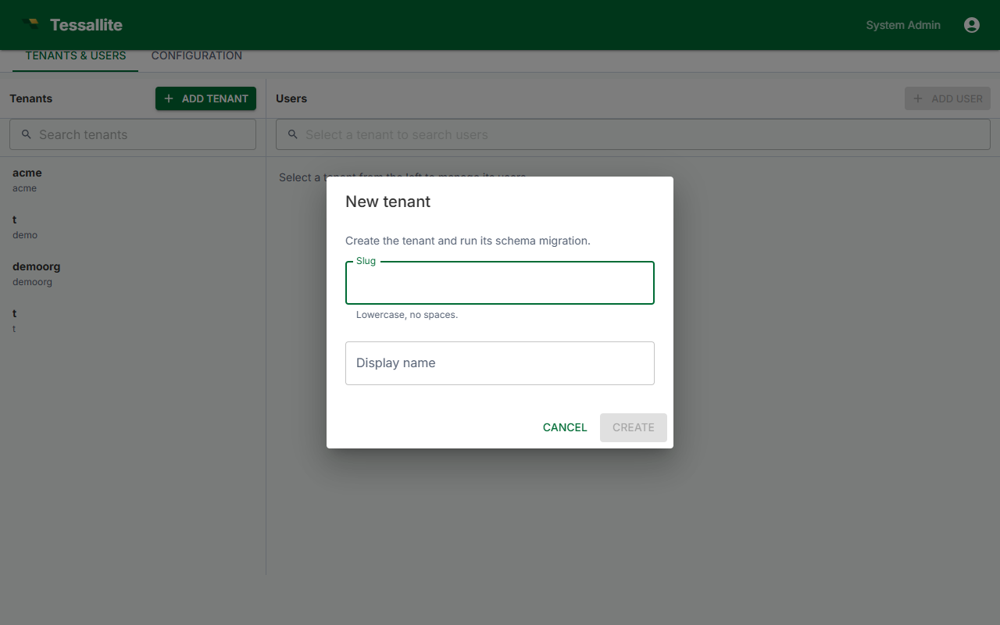

## What this covers

How to create a new tenant (workspace) in Tessallite: what a tenant is, who can create one, the required fields, what the platform provisions behind the scenes, edition limits, and best practices for naming and isolation.

---

## What is a tenant

A tenant is a fully isolated workspace inside a single Tessallite installation. Each tenant has its own users, projects, models, connections, security rules, and query history. Nothing in one tenant is visible to another. See [Workspaces and Tenants](../concepts/workspaces-and-tenants.md) for the full concept.

---

## Who can create a tenant

Only the **System Admin** can create tenants. This is the platform-level administrator account whose credentials are set by the `SYSTEM_ADMIN_EMAIL` and `SYSTEM_ADMIN_PASSWORD` environment variables in the `.env` file during deployment. The default email is `admin@tessallite.local`; the password is whatever you chose at install time.

Tenant Admins (the people who manage users and settings inside a workspace) cannot create new tenants. They operate within a workspace that the System Admin has already provisioned.

---

## Sign in as the System Admin

1. Open a browser and navigate to Tessallite (by default `http://localhost:3000`).
2. Enter the System Admin email and password. The application opens directly to the **System Administration** screen, which is only visible to this account.

If you have forgotten the System Admin password, it is stored in the `.env` file on the deployment host. See [Credentials and the .env File](credentials-and-env.md) for the full reference.

---

## Steps to create a tenant

1. In the System Administration screen, click the **Workspaces** tab.
2. Click **New Workspace**.
3. Fill in the required fields (see the field reference below).
4. Click **Create**.

Creating a workspace provisions the workspace itself -- its record and its two
database schemas. It does **not** create any user accounts. You add the first
user in a separate step; see [Add the first user](#add-the-first-user) below.

---

## Required fields

| Field | Description | Constraints |
|---|---|---|
| **Display name** | The human-readable label shown throughout the UI. Can be changed at any time after creation. | Free text; maximum 80 characters. |
| **Slug** | A short, machine-friendly identifier. This becomes the JDBC database name and the XMLA catalog name that analysts use when connecting BI tools. | Lowercase letters, numbers, and hyphens only. No spaces. Must be unique across the entire installation. |

There is no "administrator email" field. A new workspace starts with no users;
you create the first account yourself once the workspace exists.

---

## Why the slug matters

The slug is permanent. Once the workspace is created, the slug cannot be renamed, because it is wired into two critical connection paths:

- **JDBC connections** (port 5433): BI tools set the *Database* field to the slug.
- **XMLA connections** (port 8080): Excel and other XMLA clients set the *Catalog* field to the slug.

Changing the slug would break every analyst connection string, every saved workbook, and every scheduled refresh that references this workspace. Choose a clear, stable name before clicking Create. A good slug is short, descriptive, and unlikely to need changing -- for example `acme-demo`, `finance`, or `sales-na`.

---

## What gets provisioned

When you click Create, Tessallite provisions several things in the background:

1. **A SystemTenant record** in the platform database (`tessallite_system`). This is the master entry that ties the slug, display name, and encrypted connection credentials together.

2. **Two PostgreSQL schemas**, both inside the same database instance:
   - `<slug>_meta` -- stores all workspace metadata: projects, models, dimensions, measures, joins, security rules, user accounts, roles, query logs, and every other configuration object.
   - `<slug>_aggregates` -- stores materialised aggregate tables and pocket tables that the query router uses to accelerate BI queries.

   These schemas are the isolation boundary. No other tenant can read or write to them. The Fernet-encrypted database connection URL stored in the SystemTenant record ensures that even at the platform level, credentials are not exposed in plaintext.

This provisioning sequence completes in seconds. Once it finishes, the new
workspace appears in the System Admin's workspace list. The workspace has no
users yet -- add the first one next.

---

## Add the first user

A new workspace has no accounts, so nobody can sign in to it until you create
one. Tessallite does not send invitation emails; an administrator sets each
user's password directly and passes the credentials to the person out of band
(or the user signs in through single sign-on -- see below).

To create the first Tenant Admin:

1. In the System Administration screen, open the workspace you just created.
2. Click **Add User**.
3. Enter a username, the person's email address, and an initial password. The
   password must meet the complexity rule shown under the field (at least 12
   characters, with an upper-case letter, a lower-case letter, and a number).
4. Choose the **Tenant Admin** role so this first user can manage the workspace.
5. Click **Save**, then give the email and password to the new administrator.

That user can then sign in and, from the workspace **Admin > Users** tab, add
the rest of the team the same way. See [Manage Users](../admin/manage-users.md).

### Single sign-on (optional)

If the workspace is configured for single sign-on, you do not have to create
accounts by hand. The first time someone signs in through the identity
provider, Tessallite provisions their account automatically (just-in-time
provisioning) and assigns the role your SSO mapping specifies. A password is
never set for these users -- the identity provider owns authentication.

---

## Edition limits

The Community Edition enforces a cap on the number of tenants you can create. When licence enforcement is enabled, attempting to create a tenant beyond the licensed limit returns an error. The built-in demo tenant (used for evaluation and onboarding) does not count toward this cap.

If you need more tenants, upgrade your licence. See the System Administration licence panel for details.

---

## Verify the new tenant

After creating a tenant and adding its first user, confirm that provisioning succeeded:

1. Ask the Tenant Admin to sign in at the Tessallite URL using the email address and password you set when you created their account (or through single sign-on).
2. After sign-in, the Workspace Explorer should appear with the new workspace name displayed. The workspace will be empty (no projects or models yet) -- this is expected.
3. Back in the System Admin screen, the new tenant should appear in the **Workspaces** tab with an active status indicator.

If sign-in fails or the workspace does not appear, check the model-service logs (`docker compose logs -f model-service`) for schema-provisioning errors.

---

## Best practices and pitfalls

**Choose slugs carefully.** The slug is permanent and visible to every analyst who connects a BI tool. Keep it short, lowercase, and descriptive. Avoid abbreviations that could be confused with another workspace.

**One tenant per logical boundary.** Tenants are fully isolated -- they share no data, users, or configuration. Use separate tenants for separate business units, customers, or environments (development, staging, production). Do not put unrelated teams in the same tenant and rely on row security alone; tenant isolation is a stronger boundary.

**Tenant Admin is not System Admin.** The Tenant Admin manages users and settings within the workspace. They cannot create or delete workspaces, view other tenants, or change platform-level configuration. Only the System Admin has those privileges.

**Deactivating vs deleting.** To temporarily take a workspace offline without losing data, deactivate it from the System Admin Workspaces tab. Deactivated tenants cannot be signed into, but their schemas and data remain intact. Full deletion removes the schemas and all data permanently -- use it only when you are certain.

---

## Related

- [Workspaces and Tenants (concepts)](../concepts/workspaces-and-tenants.md)
- [Manage Users](../admin/manage-users.md)
- [Configure Environment Variables](configure-environment-variables.md)
- [Credentials and the .env File](credentials-and-env.md)
- [First-Time Setup](../getting-started/first-time-setup.md)

---

← [Deploy on Kubernetes](deploy-kubernetes.md) | [Home](../index.md) | [Configure Environment Variables →](configure-environment-variables.md)
