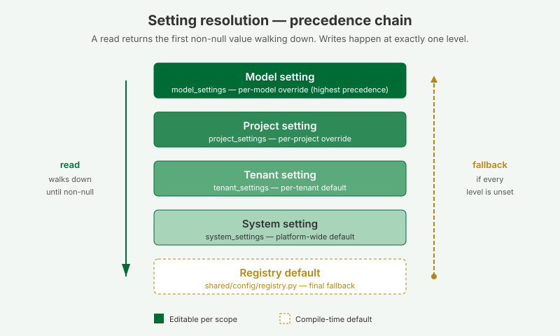
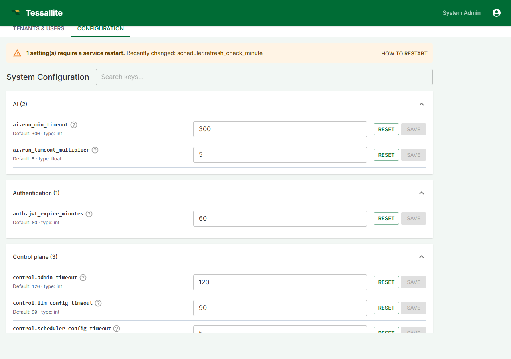
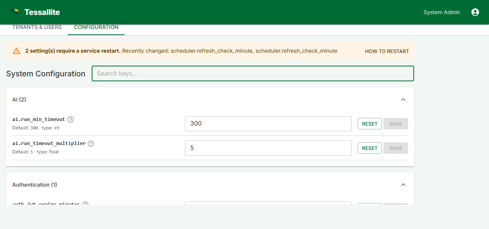
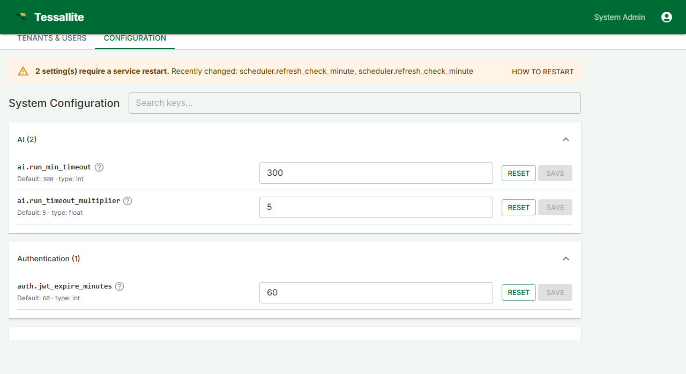

# System Configuration





## What this covers

The Configuration tab in System Admin lets you tune platform-wide settings across five sections: authentication, daily maintenance schedule, query timeouts, result limits and rate limiting, and a read-only view of the environment variables from the `.env` file.

## Tabs

| Tab | Purpose |
|---|---|
| **Auth** | Session lifetime and security settings. |
| **Daily schedule** | What time each daily maintenance task runs (aggregate cleanup, source schema check, AI advisor, predictive aggregate check, pocket table cleanup). Each shows a time picker in UTC. |
| **Timeouts** | Source database connect timeout and query timeout. |
| **Ceilings** | Maximum result rows, chunk size, tenant query rate limiting. |
| **Environment** | Read-only view of values from the host `.env` file (database DSN, JWT key, ports, CORS). |

## Rate limiting and the per-replica ceiling

The **Ceilings** section sets two rate limits. The first, `rate_limit.per_minute`, caps how many requests each tenant may make per minute **at the gateway** — the doorway that business-intelligence tools like Excel and Power BI use to send their queries. The second, `rate_limit.login_per_minute`, is a stricter ceiling on login attempts from one client address per minute; it lives on the sign-in service and slows down password guessing. When a caller exceeds either limit, the platform returns HTTP 429 with a `Retry-After` header and stops serving them until the minute rolls over. The master switch `rate_limit.enabled` turns both on or off, and changes take effect immediately — no restart.

One thing these limits deliberately do **not** cover: the everyday screens inside the app — opening a model, browsing its tables and columns — are not counted against `rate_limit.per_minute`. Opening a single model can fire dozens of small lookups, and counting those against the tenant ceiling used to lock people out of their own model. Those internal screens are handled a different way, so the request ceiling stays focused on the real incoming queries from BI tools.

There is one thing to understand before you rely on these ceilings in production. **The limit is counted per replica.** Each running copy of a service (each worker process, or each instance when the platform scales out — for example on Cloud Run) keeps its own private tally in memory. If you run three replicas, a tenant can make up to three times the configured number of requests per minute, because each replica only sees a third of the traffic and none of them share a running total. The counters also reset to zero whenever a replica restarts or a new one starts up.

This is fine for a single-instance deployment (the usual local or small setup), where there is exactly one replica and the configured number is the real ceiling. It matters once you scale horizontally and want a single, shared ceiling across every replica. To get that, point the `RATE_LIMIT_STORAGE_URI` environment variable (in the host `.env`, shown read-only on the **Environment** tab) at a shared store such as a Redis or Memcached server — for example `redis://my-redis-host:6379/0`. With a shared store configured, all replicas count against the same buckets and the configured number becomes the true platform-wide ceiling. Leaving `RATE_LIMIT_STORAGE_URI` empty keeps the default per-replica in-memory behaviour.

**Tip:** if you are seeing more requests get through than the number you set, count your replicas first — the most common cause is the per-replica tally, not a broken limit. Either set `RATE_LIMIT_STORAGE_URI` to a shared store, or pin the replica count, or simply divide your intended ceiling by the number of replicas.

Internal service-to-service traffic (for example the gateway relaying a BI query to the model service) is intentionally exempt from these limits, so throttling never breaks the query pipeline for connected BI tools.

## Who can edit it

Only the **system_admin** role can read or write here. Tenant admins, modelers, and viewers do not see the tab. Backend endpoints (`GET /api/v1/system/settings`, `PUT /api/v1/system/settings/{key}`) reject any other role.

## How values resolve

Every setting on this page is the platform default. A tenant admin can override individual keys at the tenant level; a project admin can further override at the project level; modelers can override at the model level. When a query, scheduler job, or API handler asks for a setting, the resolver walks **model → project → tenant → system → registry default** and returns the first non-null value. A `null` stored at any level means "explicitly unset, fall through".

## Editing a setting

1. Sign in as a system administrator and open System Admin → Configuration.
2. Use the search box at the top to filter by key, section, or description.
3. Find the setting you want to change. The default and the current value are displayed inline.
4. Edit the value, then click **Save**. **Reset** restores the registry default for that key.

## Restart-required settings



Some settings — daily schedule times — can only take effect when the scheduler service restarts. Saving any of these shows a yellow banner at the top of the page listing the recently-changed keys.

The **How to restart** button on that banner opens a dialog with the docker-compose / systemd procedure. After restarting, return to the Configuration tab and click **Mark all as applied** to clear the banner.

## Environment tab



The Environment tab shows read-only values from the host's `.env` file: the system DB DSN, the Fernet credential-encryption key, the JWT signing key, the system administrator's email and password, the gateway's JDBC and XMLA ports, the internal service URLs, and the CORS allow-list. Secrets are masked (`***** (32 chars)`) and the DSN's password is redacted, so an operator can verify what is in effect without exposing credentials.

To change any of these values, edit `.env` on the host and restart the affected service (or the whole stack with `docker compose restart`). See [Credentials and the .env file](credentials-and-env.md) for the full procedure.

## Per-key reference

The complete catalog of every system-level key, its type, default, restart flag, and description is generated from the registry at `docs/guides/guides_configuration-reference.md`. Regenerate after any registry change with:

```
python tessallite/scripts/gen_config_reference.py
```

## Related

- [Configure Environment Variables](configure-environment-variables.md)
- [Credentials and the .env file](credentials-and-env.md)
- [Workspace settings (tenant level)](../admin/workspace-settings.md)
- [Project settings](../admin/project-settings.md)
- [Model configuration](../admin/model-configuration.md)

---

← [Configure Environment Variables](configure-environment-variables.md) | [Home](../index.md) | [Credentials and the .env File →](credentials-and-env.md)
