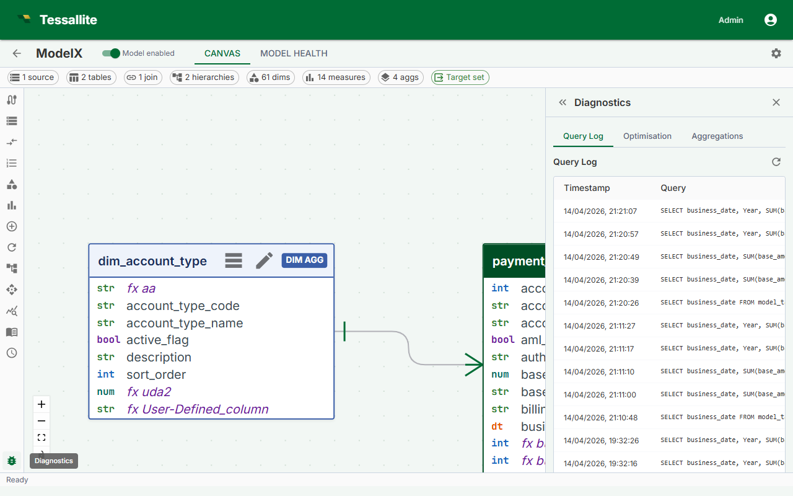

## What this covers

Diagnosing incorrect values returned by Tessallite queries. If values are wrong, the cause is almost always in the model definition, data freshness, or the underlying source data — not in the routing layer.

---

## Step 1 — Check the measure definition

Open **Model Builder** and navigate to the measure returning unexpected values.

- Verify the source column is correct. A column rename in the source table can produce wrong results if schema drift has not been detected.
- Verify the aggregation type: SUM, COUNT, COUNT DISTINCT, AVG, MIN, MAX.
- Check whether any filters are applied to the measure definition.

---

## Step 2 — Check for grain mismatch

If a query asks for totals and an aggregate exists at a finer grain, Tessallite re-aggregates the pre-built summary. This is correct for additive measures but produces wrong results for COUNT DISTINCT.

If the query uses COUNT DISTINCT and returns a value that is too high, no exact-grain aggregate exists for that query pattern. Ask your Modeller to build an aggregate at the exact grain required, or reformulate the query to match an existing aggregate grain.

---

## Step 3 — Check for stale data

In Model Builder, check the status column for each aggregate:

| Status | Meaning |
|--------|---------|
| Ready | Aggregate is current |
| Stale | Source has changed since last build — run a refresh |
| Building | Refresh in progress — wait for completion |
| Error | Last build failed — see [Aggregates Not Building](aggregates-not-building.md) |

---

## Step 4 — Check for schema drift

1. Open **Model Builder**.
2. Select the project.
3. Go to the **Health** tab.
4. Look for "Schema drift detected" warnings.
5. Update the model to reference the correct column, re-publish, and rebuild aggregates.

---

## Step 5 — Compare with a direct query

Run the equivalent query directly against the source database (bypassing Tessallite). If the direct query also returns wrong values, the problem is in the source data. If the direct query returns correct values, return to Steps 1–4.

---

## A query now returns an error where it used to "work"

Tessallite was deliberately made stricter, so a couple of cases that used to be *guessed* silently now fail with a clear error instead. If a query that ran before now errors, this is usually why — and the error is the safer outcome:

- **An unrecognised filter operator is rejected** instead of being quietly treated as equals (`=`). Previously a typo or an unsupported operator could slip through as an equality match and return the wrong rows; now it stops with an error. Check the operator on the filter and use one the model supports.
- **Sorting by a column the query does not actually select is rejected** instead of being matched to a guessed table. Previously an `ORDER BY` on an unknown column could be silently bound to the wrong column; now it errors. Add the column to the query, or sort by one that is already present.

A clear error is better than a result that *looks* right but was built on a guess. Fix the operator or the sort column and re-run — you are not losing a feature, you are being protected from a silently wrong answer.

---

## Related

- [Query Routing](../concepts/query-routing.md)
- [Aggregates Not Building](aggregates-not-building.md)
- [Common Errors](common-errors.md)
- [Excel Connection Problems](excel-connection-problems.md)

---

← [Excel Connection Problems](excel-connection-problems.md) | [Home](../index.md) | [Field Compatibility Warnings →](field-compatibility-warnings.md)
