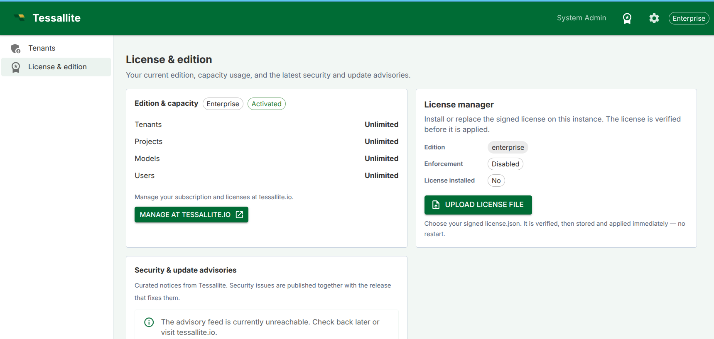

## What this covers

Installing Tessallite Community Edition on a local machine from the signed release bundle downloaded from the Tessallite website. This is the normal install path for users and evaluators. A Git repository clone is only for developers working on the source code.

## Before you start

- Role required: System Admin. You are setting up the platform itself.
- Docker Desktop 24 or later with Compose v2 must be installed and running.
- At least 4 GB of RAM is required. 8 GB is recommended.
- Ports 3000, 8001, 8080, and 5433 must be free on your machine before running the installer.
- You need a signed Community licence file from https://tessallite.io.
- OpenSSL and python3 must be available on the host. Signature verification also needs python3 with the `cryptography` package.

## Steps

1. Register at https://tessallite.io and download your signed Community licence.
2. Download the current Tessallite Community release bundle from the website.
3. Unpack the bundle and open a terminal in the release directory.
4. Verify `SHA256SUMS` and `SHA256SUMS.sig` before running anything. The full commands are in `docs/guides/guides_community-install.md`.
5. Copy your signed licence into the bundle root as `license.json`.
6. Run:
   ```bash
   chmod +x ./install.sh
   ./install.sh
   ```
7. The installer checks Docker, ports, disk space, the licence file, and the public verification key. It creates `.env` from `.env.example` if needed, generates strong secrets, loads bundled images when present, starts the stack, runs the system schema migration, and seeds the demo tenant.
8. When the installer completes, open `http://localhost:3000`.

## What starts

After the script completes, the following services are running:

| Service | Address | What it does |
|---|---|---|
| Frontend | http://localhost:3000 | Web management interface |
| Model Service | http://localhost:8001 | Metric definitions and access control |
| Query Router | http://localhost:8002 | Query parsing, routing, and execution |
| Optimizer | http://localhost:8003 | Automatic aggregate creation |
| Scheduler | http://localhost:8004 | Aggregate refresh and drift detection |
| Gateway (JDBC) | localhost:5433 | BI tool database connection |
| Gateway (XMLA) | http://localhost:8080 | Excel and Power BI connection |

## Configuration

All bootstrap settings live in one file: `.env` in the bundle directory, created from `.env.example`. `install.sh` fills empty secret values such as `POSTGRES_PASSWORD`, `JWT_SECRET_KEY`, `SYSTEM_ADMIN_PASSWORD`, and `CREDENTIAL_ENCRYPTION_KEY`; it does not overwrite values you already set.

Licence activation starts from a signed `license.json` file. The installer can check the file beside the bundle, and the in-product License Manager can then store an uploaded licence in the platform database. The signed licence is verified locally before it is applied.



After first install, a system administrator can open **System Admin → License & edition** to see the active edition, capacity, enforcement state, and whether a licence is installed. The **Upload license file** button lets the admin choose a replacement `license.json`; Tessallite verifies the signature and expiry, stores the licence in the platform database, and applies it without a restart.

Day-to-day operational tuning (rate limits, cache, scheduler cadence) is editable later from the **System Admin → Configuration** screen, so you rarely touch `.env` again after setup except for secrets, host ports, licence replacement, or upgrades.

### Important: LLM cost safety

If you turn on the conversational agent, each project supplies its own LLM API key, so usage is billed to your own provider account. One setting protects you from accidental platform-side charges:

- **`LLM_ALLOW_SERVICE_ACCOUNT_AUTH`** — leave this `false` (the default). While `false`, an agent can authenticate **only** with a bring-your-own API key. Setting it `true` would also allow cloud service-account billing (for example Google Vertex AI), which charges the **machine's** cloud project instead of the key — an easy way to run up unexpected cost. Only enable it if you intend to pay for LLM usage from the host's cloud account.

The full per-parameter catalogue, including which file carries it in each deployment mode, is in the configuration reference (`docs/guides/guides_configuration-reference.md`).

## Re-running the script

The installer is idempotent. Re-running `./install.sh` preserves existing `.env` values and re-checks the stack. This is useful after an interrupted first install or a host restart.

## Stopping the services

To stop all containers from the bundle directory, run:

```bash
docker compose down
```

To remove the stack and all stored data, run `docker compose down -v`. Back up `.env`, `license.json`, and the PostgreSQL volume before using `-v`.

## Troubleshooting

| Symptom | Likely cause | What to do |
|---|---|---|
| Port already in use | Another application is using port 3000, 8001, 8080, or 5433 | Stop the conflicting application or change the port in `.env` before re-running `install.sh` |
| Docker not found | Docker Desktop is not installed or not running | Install Docker Desktop and start it before running the script |
| Licence rejected | `license.json` is missing, corrupt, expired, or not signed by a trusted Tessallite key | Re-copy the licence from your registration email or tessallite.io and upload that signed file |
| License manager cannot upload a file | The selected file is not valid JSON, is expired, or is not signed by a trusted Tessallite key | Download the latest licence again from tessallite.io and upload that signed `license.json` |
| Bundle signature fails | Wrong release key or modified bundle | Stop. Re-download the bundle and verify the key from tessallite.io |
| Image pull fails | Online bundle could not reach the registry | Check internet access, or use the offline bundle with `images/*.tar` |
| localhost:3000 shows nothing | Services still starting | Wait 60 seconds and refresh |

## Related

- [First-time setup](first-time-setup.md)
- [Install on GCP](install-gcp.md)
- [Service reference](../system-admin/service-reference.md)

---

← [Demo tenant: acme-demo](acme-demo-tenant.md) | [Home](../index.md) | [Deploy Tessallite to Google Cloud Platform →](install-gcp.md)
